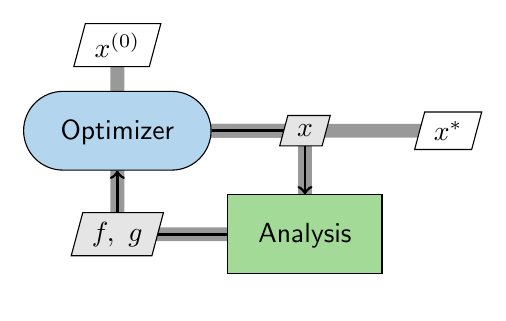
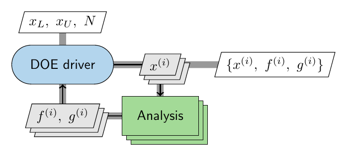
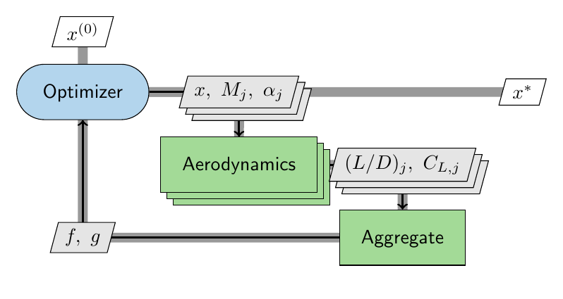
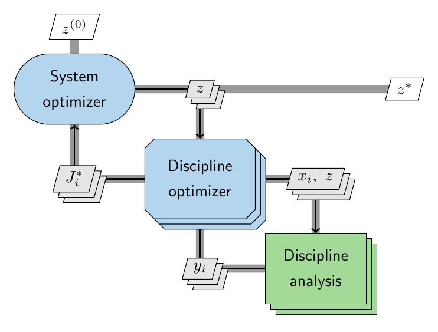
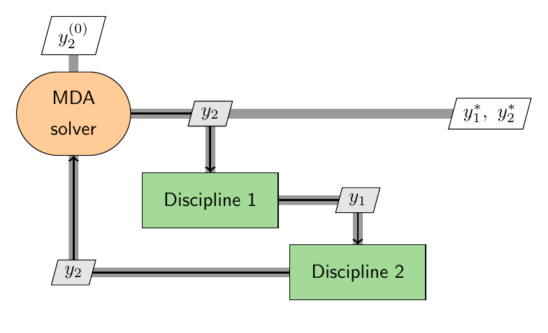
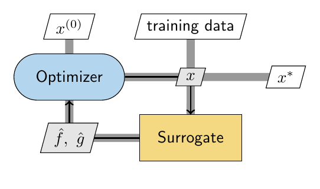
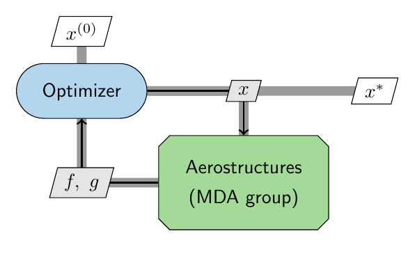
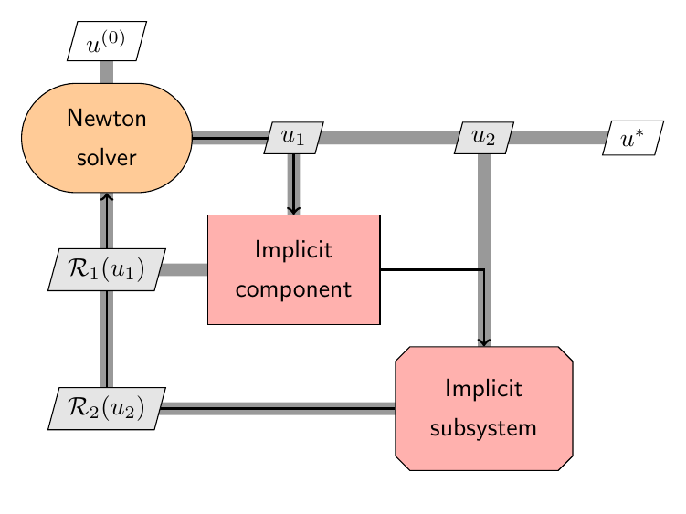

# Lesson 1 — Design Structure Matrices (DSM), N2, and XDSM

**Goal.** Learn to read and produce a *Design Structure Matrix* — the picture that
tells you how a multidisciplinary model is wired, which pieces feed which, and
where the coupled loops are. We use the ASW conceptual-sizing model
(`aircraft_sizing.examples.ex_01_asw`) as the running example and generate two
views of it: OpenMDAO's automatic **N2** and a hand-authored **XDSM**.

Prerequisites: the `eng-des-opt-course` conda environment (installs OpenMDAO, JAX,
pyXDSM). Rendering the XDSM to PNG/PDF also needs `pdflatex` and `pdftoppm` on PATH.

---

## 1. What is a DSM?

A **Design Structure Matrix** is a square matrix whose diagonal holds the
components (disciplines, analyses, solvers) of a model, and whose off-diagonal
cells hold the *data passed between them*. If component **A** produces a value that
component **B** consumes, you put an entry in the row/column that connects A to B.

The magic is in the ordering. Once the components are laid out along the diagonal:

- Entries **above** the diagonal are **feed-forward** — data flowing to a component
  that runs *later*. A model with only feed-forward coupling can be evaluated in a
  single pass, top to bottom.
- Entries **below** the diagonal are **feedback** — data flowing *back* to a
  component that already ran. Every feedback entry marks a loop that must be
  *converged* with an iterative solver (Lesson 2).

So a DSM answers, at a glance: *what is my execution order, and what has to be
iterated?*

---

## 2. The ASW model as a DSM

The ASW sizing model has five disciplines:

| Component | Reads | Produces |
|---|---|---|
| `aero` (Aerodynamics) | `AR`, `S_wet/S_ref` | `L/D` at cruise and loiter |
| `prop` (Propulsion) | `M`, `a`, TSFC | cruise speed, per-second TSFC |
| `mission` (Mission fuel) | `L/D`, `V`, TSFC, `R`, `E` | fuel weight fraction `Wf/WTO` |
| `struct` (Structures) | `W_TO` | empty-weight fraction `We/WTO` |
| `sizing` (Sizing residual) | `Wf/WTO`, `We/WTO`, `W_fixed` | `W_TO` |

Trace the data flow and one structural fact jumps out. `aero` and `prop` feed
`mission`; `mission` feeds `sizing`. All feed-forward. The *only* backward edge is
`sizing → struct`: the sizing block produces a takeoff gross weight `W_TO`, which
Structures needs to estimate the empty-weight fraction, which sizing then needs to
recompute `W_TO`. That is the single **feedback loop** in the whole model — the
`struct ↔ sizing` cycle — and it is exactly the fixed point of Raymer's method.

Everything hard about this problem lives in that one loop. Everything else is a
one-pass calculation.

---

## 3. View A — OpenMDAO's N2 (automatic)

OpenMDAO can emit a DSM directly from the model object — no bookkeeping by hand.
Generate it with:

```bash
python lessons/lesson_01_dsm/generate_n2.py
```

That builds the ASW problem, runs it, and writes `outputs/asw_n2.html`. Open it in
a browser. The **N2** (N-squared) diagram is a DSM with an interactive twist:

- The **diagonal** shows the model tree (the group and its five components).
- **Off-diagonal blocks** are the connections. Hover or click a component to
  highlight what it sends and receives.
- Connections drawn in the **upper triangle are feed-forward**; the one in the
  **lower triangle is the `sizing → struct` feedback**. OpenMDAO even draws the
  feedback connection in a distinct style and marks the solver loop that wraps it.

The N2 is generated from the *actual* model, so it can never drift out of sync with
the code. It is the diagram you check while building or debugging a model.

---

## 4. View B — a hand-authored pyXDSM (publication-ready)

The **XDSM** (eXtended Design Structure Matrix) is the same idea, drawn for
communication rather than debugging. It adds the solver, the external inputs, and
labels on every data edge. Generate it with:

```bash
python lessons/lesson_01_dsm/generate_xdsm.py
```

which renders `outputs/asw_xdsm.png` (and `.pdf`):


Read it exactly like the DSM above. `aero` and `prop` sit in the upper-left and
push `L/D` and `V, sfc` forward into `mission`; `mission` pushes `Wf/WTO` forward
to `sizing`. The **nonlinear solver** (orange) drives the guess `W_TO^(k)` into
`struct`; `struct` returns `We/WTO` to `sizing`; and `sizing` returns the residual
`R(W_TO)` back *up-left* to the solver — the one edge below the diagonal, i.e. the
feedback loop. When it is converged, the solver emits `W_TO*`.

The XDSM is authored by hand (`ex_01_asw/viz/xdsm/asw_sizing_xdsm.py`) so you
control the layout, symbols, and which quantities to emphasize — the reason it is
the diagram you put in a paper or a slide.

---

## 5. N2 vs XDSM — same structure, two purposes

Both are DSMs of the *same* model:

| | OpenMDAO N2 | pyXDSM |
|---|---|---|
| Source | generated from the live model | authored by hand |
| Format | interactive HTML | LaTeX → PDF/PNG |
| Strength | always correct, great for debugging | curated, great for publication |
| Shows the feedback loop? | yes (highlight + solver box) | yes (edge below the diagonal) |

Use the N2 while you build; use the XDSM to explain the result.

---

## 6. A wider vocabulary of XDSM shapes

The ASW diagram in §4 used only **two** shapes: the green **analysis rectangle**
(`FUNC`) for each discipline, and the orange **solver pill** (`SOLVER`) that drove
the coupled loop. Real MDO diagrams — the ones in the [pyXDSM
examples](https://github.com/mdolab/pyXDSM) and in [Lambe & Martins
(2012)](https://mdolab.engin.umich.edu/bibliography/Lambe2012a.html), the paper
that standardized the notation — use a handful more. There is a simple logic
behind them, so you can read a new shape without a legend:

- **Shape = role.** A **pill** (rounded box) is a *driver*: something that calls
  the boxes to its lower-right *repeatedly* until a target is met — an
  **optimizer**, a **DOE driver**, or the **MDA solver** you already met. A plain
  **rectangle** is a single *analysis* that runs *once* when called. A **chamfered
  box** is a *group* — a driver-plus-analyses bundled into one reusable sub-block
  (e.g. a nested optimization).
- **Color = kind.** Optimizers and DOE drivers are **blue**, the MDA solver is
  **orange**, analyses are **green**, surrogates (metamodels) are **yellow**.
- **Reading rule is unchanged.** Off-diagonal *above* the diagonal is
  feed-forward, *below* is feedback, and the thick gray line is the process
  (execution) order.

Generate the eight small examples below with:

```bash
python lessons/lesson_01_dsm/generate_shapes.py   # -> outputs/shape_*.pdf/.png
```

Each is hand-authored the same way as the ASW XDSM (`generate_shapes.py`), so you
can read the ~10 lines of builder code next to each figure.

### 6.1 Optimization (`OPT`)



The blue **optimizer pill** *owns the design variables* `x`. It pushes a trial `x`
down into the analysis, reads back the objective `f` and constraints `g`, and
repeats — searching until an optimality (KKT) target is met, then emitting the
optimum `x*`. The single edge below the diagonal (`f, g` returning to the
optimizer) *is* the optimization loop.

It looks like the solver from §4 because both are drivers wrapping a loop — but
they solve different problems. A **solver** drives *residuals to zero*
(feasibility: "make the model self-consistent"); an **optimizer** drives an
*objective to a minimum subject to constraints* ("make the model best"). Same
pill shape, different color (orange vs blue), different job.

**In OpenMDAO →** the `Problem`'s **driver**: `prob.driver =
om.ScipyOptimizeDriver()` (or `om.pyOptSparseDriver`), with
`model.add_design_var / add_objective / add_constraint`.

### 6.2 Design of experiments (`DOE`)



A **DOE driver** is also a blue pill — it, too, calls the analysis in a loop — but
it has *no* optimality or convergence target. It evaluates the model at a
*designed set of points* (full factorial, Latin hypercube, Sobol, …) given the
bounds `x_L, x_U` and a sample count `N`, and simply *collects* the responses.
That sample table is the product, used for design-space exploration, sensitivity
screening, or fitting a surrogate (a `METAMODEL`, drawn as a yellow rectangle).
Where the optimizer *searches*, the DOE *sweeps*.

**In OpenMDAO →** `prob.driver = om.DOEDriver(om.LatinHypercubeGenerator(...))` —
also `om.FullFactorialGenerator`, `om.UniformGenerator`, `om.ListGenerator`,
`om.CSVGenerator`.

Notice the analysis here is drawn as a **stack of sheets** — that is the next
idea.

### 6.3 Repeated / parallel instances (`stack=True`)



`stack=True` draws a box — and the data edges touching it — as a **stack of
sheets**, meaning *many independent instances of the same component*, one per case
`j`: a flight condition, a load case, a DOE sample, a scenario. Because the
instances share no data with each other, they can be evaluated **in parallel**; a
following **aggregate** box then reduces the per-case outputs into the scalar
objective/constraints the driver needs.

Above, an optimizer sizes the aircraft while the aerodynamics box is evaluated
across several flight conditions `j` at once (`(L/D)_j`, `C_{L,j}`), then
aggregated. In §6.2 it was a DOE fanning the analysis over its samples. In code
it is just `stack=True` on both the `add_system` and the `connect` calls.

**In OpenMDAO →** `om.ParallelGroup` (instances on separate MPI ranks) or a
*vectorized* component (one component sized over `num_nodes` cases — the pattern
Dymos uses).

### 6.4 Bi-level (nested) optimization (`SUBOPT`)



Some architectures put an optimizer *inside* another. The chamfered blue
**`SUBOPT`** box is a discipline-level optimizer living inside the system-level
loop. The **system optimizer** (top pill) sets the shared/target variables `z`;
each **discipline sub-optimizer** (chamfered — and stacked, because there is one
per discipline, solved independently) minimizes a *local* objective/infeasibility
by running its own analysis, and returns its optimized value `J_i*` back up. That
is **two nested optimization loops**: the outer one over `z`, an inner one inside
each discipline.

This is the skeleton of distributed-MDO architectures such as **Collaborative
Optimization (CO)** and **BLISS** — contrast it with the single-level `OPT` of
§6.1, where every variable lives in one loop. It also *composes* the earlier
ideas: the sub-optimizer is a `SUBOPT` **group** shape, drawn with `stack=True`.

**In OpenMDAO →** there is no single primitive: you wrap an *inner* `om.Problem`
and call `subprob.run_driver()` from inside a component (e.g. built on
`om.SubmodelComp`), so the outer driver sees one block.

### 6.5 The MDA solver (`SOLVER`), minimal form



You met this orange pill in §4 wrapping the ASW `struct ↔ sizing` loop; here it is
in textbook form. Two disciplines each need the other's output (`Discipline 1`
needs `y_2`, `Discipline 2` needs `y_1`). The **MDA solver** (*multidisciplinary
analysis*) owns the coupling variable, feeds a guess `y_2` forward, and iterates
until the value that returns matches — the edge below the diagonal is the coupling
loop. Like the optimizer it is a driver (a pill), but its target is *feasibility*
(make the model self-consistent), not *optimality*.

**In OpenMDAO →** a **nonlinear solver** on the group:
`group.nonlinear_solver = om.NonlinearBlockGS()` / `om.NewtonSolver()` /
`om.BroydenSolver()` (plus a linear solver such as `om.DirectSolver`). See
`make_nonlinear_solver` in `ex_01_asw/methods/group.py`.

### 6.6 Surrogates / metamodels (`METAMODEL`)



A **metamodel** (yellow rectangle) is a cheap surrogate — a polynomial,
Kriging/Gaussian-process, or neural-net fit — that *stands in for* an expensive
analysis. It is trained offline from data (usually a DOE, §6.2), and the optimizer
then searches its predictions `f̂, ĝ` instead of paying for the true analysis on
every iteration. Same rectangle shape as a `FUNC`, colored yellow to flag "this is
an approximation, not the real thing."

**In OpenMDAO →** `om.MetaModelStructuredComp` or `om.MetaModelUnStructuredComp`
(surrogates `om.KrigingSurrogate`, `om.ResponseSurface`, `om.NearestNeighbor`); or
an SMT (Surrogate Modeling Toolbox) surrogate wrapped in a component.

### 6.7 Groups (`GROUP`)



A **group** (green *chamfered* box) is several components bundled and exposed as
*one* block — the way OpenMDAO nests groups inside groups. You draw a group when
its internals are not the point of the figure: here an optimizer drives an
`Aerostructures` group that hides an internal aero-structures MDA behind a single
`x → f, g` interface. Same green as a `FUNC` (it is explicit — outputs computed
from inputs), but chamfered to say "there is more inside." (`SUBOPT` in §6.4 is
the same chamfered shape in blue: a group that happens to contain an optimizer.)

**In OpenMDAO →** `om.Group` with `add_subsystem(...)` — e.g. `ASWSizingGroup` in
`ex_01_asw/methods/group.py`.

### 6.8 Implicit components (`IFUNC`, `IGROUP`)



Everything green so far has been *explicit*: `output = f(input)`, computed in one
forward pass. An **implicit** component is the opposite — it does not compute its
states directly; it defines a **residual** `R(u) = 0` that an outer solver must
drive to zero by choosing the state `u`. pyXDSM colors these **salmon**: `IFUNC`
(rectangle) is an implicit function, `IGROUP` (chamfered box) an implicit
subsystem. Above, a Newton solver feeds trial states `u_1, u_2` in and reads
residuals `R_1, R_2` back until both vanish. This is the shape behind any
"component that owns a nonlinear equation" — including the ASW sizing residual,
which is implicit in `W_TO`.

**In OpenMDAO →** `om.ImplicitComponent` (prebuilt: `om.BalanceComp`,
`om.EQConstraintComp`); an implicit *group* is just an `om.Group` with a cycle
that owns a nonlinear solver. The ASW `Sizing` class **is** an
`om.ImplicitComponent` (`ex_01_asw/methods/components.py`).

### 6.9 Shape reference

| pyXDSM constant | Drawn as | Color | Represents |
|---|---|---|---|
| `OPT` | pill (rounded) | blue | optimizer — *searches* for an optimum |
| `DOE` | pill (rounded) | blue | DOE driver — *sweeps* a designed sample set |
| `SOLVER` (`MDA`) | pill (rounded) | orange | solver — drives a coupled loop to feasibility |
| `SUBOPT` | chamfered box | blue | sub-optimizer nested in a larger loop |
| `GROUP` | chamfered box | green | a bundle of components exposed as one sub-block |
| `IGROUP` | chamfered box | salmon | an *implicit* group (exposes residuals to a solver) |
| `FUNC` | rectangle | green | a single (explicit) analysis / discipline |
| `IFUNC` | rectangle | salmon | an *implicit* analysis (exposes a residual) |
| `METAMODEL` | rectangle | yellow | a surrogate standing in for an analysis |
| `stack=True` | stacked sheets | — | many parallel instances of the box it decorates |

The **data** nodes carry the same information as the DSM off-diagonal cells: a
**gray parallelogram** is data passed *between* components, and a **white
parallelogram** is an external input or output of the whole diagram.

### 6.10 How the shapes map to OpenMDAO

The shapes are not just for slides — each one is a construct you actually write.
In OpenMDAO the mapping is nearly one-to-one, and you have **already met four of
them** in `ex_01_asw` (`methods/components.py`, `methods/group.py`):

| pyXDSM shape | OpenMDAO construct | In this repo? |
|---|---|---|
| `FUNC` | `om.ExplicitComponent` (`om.ExecComp` for one-liners) | ✅ `Aerodynamics`, `Propulsion`, `MissionFuel`, `Structures` |
| `IFUNC` | `om.ImplicitComponent` (prebuilt: `om.BalanceComp`, `om.EQConstraintComp`) | ✅ `Sizing` |
| `SOLVER` (`MDA`) | a Group's `nonlinear_solver`: `om.NonlinearBlockGS` / `om.NewtonSolver` / `om.BroydenSolver` (+ a linear solver) | ✅ `make_nonlinear_solver` |
| `GROUP` | `om.Group` + `add_subsystem(...)` | ✅ `ASWSizingGroup` |
| `IGROUP` | an `om.Group` with a cycle/implicit states, so it owns a nonlinear solver | ✅ the ASW group wraps the `struct ↔ sizing` cycle |
| `OPT` | the `Problem` **driver**: `om.ScipyOptimizeDriver` (or `om.pyOptSparseDriver`) | — later lesson |
| `DOE` | `om.DOEDriver(generator)` — `LatinHypercube` / `FullFactorial` / `Uniform` / `List` / `CSV` | — later lesson |
| `METAMODEL` | `om.MetaModelStructuredComp` / `om.MetaModelUnStructuredComp` (or an SMT surrogate) | — SMT lesson |
| `SUBOPT` | a component running an inner `om.Problem`'s `run_driver()` (e.g. `om.SubmodelComp`) | — |
| `stack=True` | `om.ParallelGroup`, or a vectorized (`num_nodes`) component | — |

A few mappings are worth dwelling on, because they explain *why* the diagram is
drawn the way it is:

- **Driver vs. solver — the pills live at different levels.** The optimizer and
  DOE are `Problem.driver` objects: they sit *outside* the model and repeatedly
  call `run_model()`. The MDA solver is a `Group.nonlinear_solver`: it lives
  *inside* the model. That is exactly the XDSM picture — the solver pill wraps a
  loop *within* the diagram, while an optimizer/DOE pill wraps the *whole*
  diagram. It is why the ASW code writes `prob.model.nonlinear_solver = ...`, and
  an optimizer would instead be `prob.driver = ...`.
- **Explicit vs. implicit = the two component base classes.**
  `om.ExplicitComponent` implements `compute()` (`output = f(input)`) — the green
  `FUNC`. `om.ImplicitComponent` implements `apply_nonlinear()`, returning a
  residual a solver must zero — the salmon `IFUNC`. The ASW `Sizing` component is
  literally an `ImplicitComponent`, which is *why* the group needs a nonlinear
  solver at all.
- **Groups nest; "implicit" is about the residual, not a different class.** Both
  `GROUP` and `IGROUP` are `om.Group`; the salmon coloring only signals that the
  group owns coupled/implicit states (a cycle) and therefore carries a nonlinear
  solver. `SUBOPT` is the same box with an optimizer inside — expressed in
  OpenMDAO as a sub-`Problem`.
- **`stack=True` is a modeling choice, not one class.** If the instances run in
  separate processes, use `om.ParallelGroup`. If they are just many evaluations of
  the same math, the idiomatic approach is a *vectorized* component: give the
  inputs a leading `num_nodes` dimension and compute every case in one
  `compute()` call. Either way the stack marks "N of these."

---

## 7. Why the structure matters

The DSM is not decoration — it dictates *how you solve the model*. Because
`aero → prop → mission` is pure feed-forward, those blocks run once. The
`struct ↔ sizing` feedback is the only part that must be iterated to
self-consistency, and how you iterate it (fixed point vs Newton vs Broyden), and
whether you feed the solver analytic gradients, is the entire subject of **Lesson
2 — Iterative methods**.

---

## 8. Try it

1. Open `outputs/asw_n2.html` and click the `sizing` component. Confirm that its
   only *incoming* connection from a later component is `takeoff_gross_weight` from
   `struct` — the feedback edge.
2. In `ex_01_asw/viz/xdsm/asw_sizing_xdsm.py`, the diagonal order is chosen so the
   single feedback edge is the only entry below the diagonal. Re-order the
   `add_system` calls (e.g. put `sizing` before `struct`) and re-render — watch a
   second edge drop below the diagonal. What does that imply about execution order?
3. Sketch the DSM you would get if empty weight *also* fed back into aerodynamics
   (e.g. wing area grew with `W_TO`). How many feedback edges now? Would one solver
   still suffice?
4. In `generate_shapes.py`, wrap the whole ASW model in an optimizer: add an `OPT`
   box that owns a design variable (say aspect ratio `AR`), drives the existing
   solver-wrapped model, and reads back an objective (minimize `W_TO`). Which shape
   does the *solver* keep, and which new shape does the *optimizer* get? This is the
   MDF architecture you will build for real in a later lesson.
5. Change `build_doe`'s analysis to a `METAMODEL` and add a downstream `OPT` that
   searches the surrogate instead of the true analysis. You have just drawn the
   two-stage "sample → fit → optimize" workflow.
