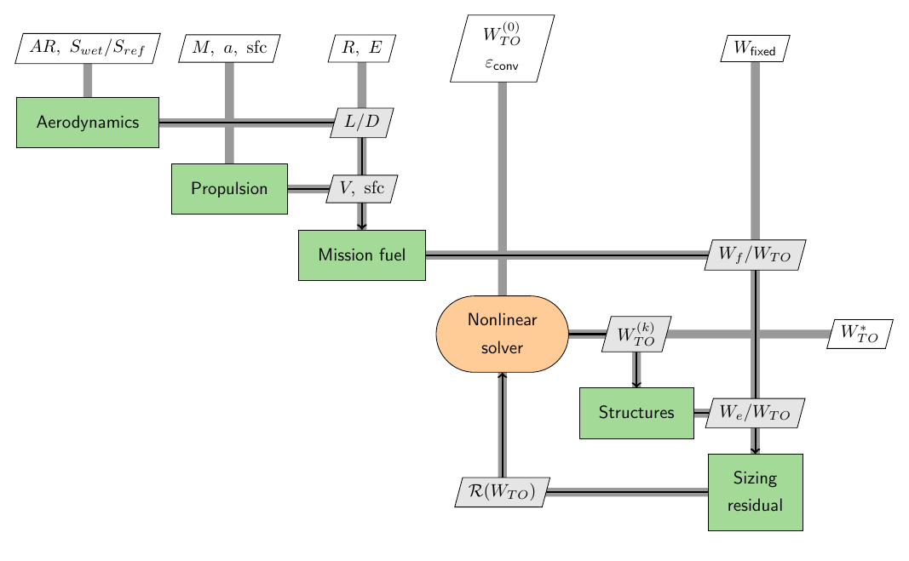

# Lesson 1 — Design Structure Matrices (DSM), N2, and XDSM

**Goal.** Learn to read and produce a *Design Structure Matrix* — the picture that
tells you how a multidisciplinary model is wired, which pieces feed which, and
where the coupled loops are. We use the ASW conceptual-sizing model
(`aircraft_sizing.examples.ex_01_asw`) as the running example and generate two
views of it: OpenMDAO's automatic **N2** and a hand-authored **XDSM**.

Prerequisites: the `aircraft-sizing` conda environment (installs OpenMDAO, JAX,
pyXDSM). Rendering the XDSM to PNG/PDF also needs `pdflatex` and `pdftoppm` on PATH.

---

## 1. What is a DSM?

A **Design Structure Matrix** is a square matrix whose diagonal holds the
components (disciplines, analyses, solvers) of a model, and whose off-diagonal
cells hold the *data passed between them*. If component **A** produces a value that
component **B** consumes, you put an entry in the row/column that connects A to B.

The magic is in the ordering. Once the components are laid out along the diagonal:

- Entries **above** the diagonal are **feed-forward** — data flowing to a component
  that runs *later*. A model with only feed-forward coupling can be evaluated in a
  single pass, top to bottom.
- Entries **below** the diagonal are **feedback** — data flowing *back* to a
  component that already ran. Every feedback entry marks a loop that must be
  *converged* with an iterative solver (Lesson 2).

So a DSM answers, at a glance: *what is my execution order, and what has to be
iterated?*

---

## 2. The ASW model as a DSM

The ASW sizing model has five disciplines:

| Component | Reads | Produces |
|---|---|---|
| `aero` (Aerodynamics) | `AR`, `S_wet/S_ref` | `L/D` at cruise and loiter |
| `prop` (Propulsion) | `M`, `a`, TSFC | cruise speed, per-second TSFC |
| `mission` (Mission fuel) | `L/D`, `V`, TSFC, `R`, `E` | fuel weight fraction `Wf/WTO` |
| `struct` (Structures) | `W_TO` | empty-weight fraction `We/WTO` |
| `sizing` (Sizing residual) | `Wf/WTO`, `We/WTO`, `W_fixed` | `W_TO` |

Trace the data flow and one structural fact jumps out. `aero` and `prop` feed
`mission`; `mission` feeds `sizing`. All feed-forward. The *only* backward edge is
`sizing → struct`: the sizing block produces a takeoff gross weight `W_TO`, which
Structures needs to estimate the empty-weight fraction, which sizing then needs to
recompute `W_TO`. That is the single **feedback loop** in the whole model — the
`struct ↔ sizing` cycle — and it is exactly the fixed point of Raymer's method.

Everything hard about this problem lives in that one loop. Everything else is a
one-pass calculation.

---

## 3. View A — OpenMDAO's N2 (automatic)

OpenMDAO can emit a DSM directly from the model object — no bookkeeping by hand.
Generate it with:

```bash
python lessons/lesson_01_dsm/generate_n2.py
```

That builds the ASW problem, runs it, and writes `outputs/asw_n2.html`. Open it in
a browser. The **N2** (N-squared) diagram is a DSM with an interactive twist:

- The **diagonal** shows the model tree (the group and its five components).
- **Off-diagonal blocks** are the connections. Hover or click a component to
  highlight what it sends and receives.
- Connections drawn in the **upper triangle are feed-forward**; the one in the
  **lower triangle is the `sizing → struct` feedback**. OpenMDAO even draws the
  feedback connection in a distinct style and marks the solver loop that wraps it.

The N2 is generated from the *actual* model, so it can never drift out of sync with
the code. It is the diagram you check while building or debugging a model.

---

## 4. View B — a hand-authored pyXDSM (publication-ready)

The **XDSM** (eXtended Design Structure Matrix) is the same idea, drawn for
communication rather than debugging. It adds the solver, the external inputs, and
labels on every data edge. Generate it with:

```bash
python lessons/lesson_01_dsm/generate_xdsm.py
```

which renders `outputs/asw_xdsm.png` (and `.pdf`):



Read it exactly like the DSM above. `aero` and `prop` sit in the upper-left and
push `L/D` and `V, sfc` forward into `mission`; `mission` pushes `Wf/WTO` forward
to `sizing`. The **nonlinear solver** (orange) drives the guess `W_TO^(k)` into
`struct`; `struct` returns `We/WTO` to `sizing`; and `sizing` returns the residual
`R(W_TO)` back *up-left* to the solver — the one edge below the diagonal, i.e. the
feedback loop. When it is converged, the solver emits `W_TO*`.

The XDSM is authored by hand (`ex_01_asw/viz/xdsm/asw_sizing_xdsm.py`) so you
control the layout, symbols, and which quantities to emphasize — the reason it is
the diagram you put in a paper or a slide.

---

## 5. N2 vs XDSM — same structure, two purposes

Both are DSMs of the *same* model:

| | OpenMDAO N2 | pyXDSM |
|---|---|---|
| Source | generated from the live model | authored by hand |
| Format | interactive HTML | LaTeX → PDF/PNG |
| Strength | always correct, great for debugging | curated, great for publication |
| Shows the feedback loop? | yes (highlight + solver box) | yes (edge below the diagonal) |

Use the N2 while you build; use the XDSM to explain the result.

---

## 6. Why the structure matters

The DSM is not decoration — it dictates *how you solve the model*. Because
`aero → prop → mission` is pure feed-forward, those blocks run once. The
`struct ↔ sizing` feedback is the only part that must be iterated to
self-consistency, and how you iterate it (fixed point vs Newton vs Broyden), and
whether you feed the solver analytic gradients, is the entire subject of **Lesson
2 — Iterative methods**.

---

## 7. Try it

1. Open `outputs/asw_n2.html` and click the `sizing` component. Confirm that its
   only *incoming* connection from a later component is `takeoff_gross_weight` from
   `struct` — the feedback edge.
2. In `ex_01_asw/viz/xdsm/asw_sizing_xdsm.py`, the diagonal order is chosen so the
   single feedback edge is the only entry below the diagonal. Re-order the
   `add_system` calls (e.g. put `sizing` before `struct`) and re-render — watch a
   second edge drop below the diagonal. What does that imply about execution order?
3. Sketch the DSM you would get if empty weight *also* fed back into aerodynamics
   (e.g. wing area grew with `W_TO`). How many feedback edges now? Would one solver
   still suffice?
