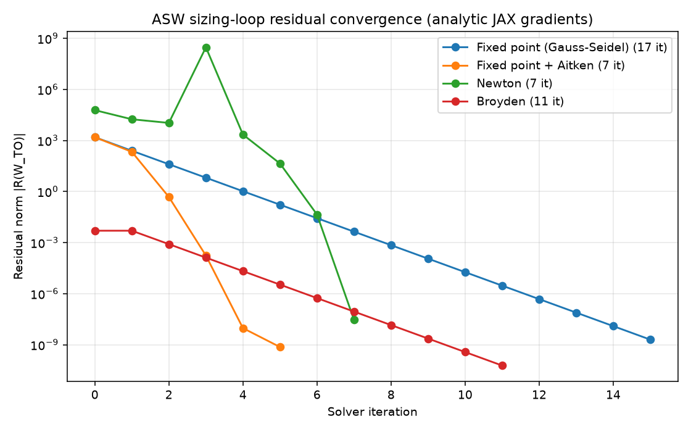

# Lesson 2 — Iterative methods: fixed point, Newton, Broyden, and gradients vs finite difference

**Goal.** Understand *how* the one coupled loop in the ASW model gets converged, and
what it costs. We solve the identical model four ways — fixed-point (Gauss–Seidel),
Aitken-accelerated fixed point, Newton, and Broyden — and count **iterations** and
**function / derivative evaluations** for each. Then we look at where a Newton step
gets its Jacobian: **analytic JAX gradients** versus **finite difference**.

Reproduce every number and figure below with:

```bash
python lessons/lesson_02_iterative_methods/asw/compare_solvers.py
```

which writes `outputs/solver_comparison.md` and `outputs/convergence.png`.

Prerequisite: Lesson 1 (the DSM). The whole lesson is about the single feedback
loop that Lesson 1 identified.

---

## 1. The problem: one fixed point

From Lesson 1, the ASW model is feed-forward except for the `struct ↔ sizing`
loop. Structures needs a takeoff gross weight to estimate the empty-weight
fraction; sizing needs that fraction to compute the takeoff gross weight. Written
as a residual, we need the `W_TO` that makes

```
R(W_TO) = W_TO * (1 - Wf/WTO - We/WTO(W_TO)) - W_fixed = 0.
```

`Wf/WTO` (from aero + propulsion + mission) does **not** depend on `W_TO`, so the
only nonlinearity is `We/WTO(W_TO) = a·W_TO^b`. Everything below is a different
strategy for driving that scalar residual to zero — and each is just a choice of
`nonlinear_solver` on the OpenMDAO group (`ex_01_asw/methods/group.py`).

---

## 2. Four strategies

**Fixed-point / Nonlinear Block Gauss–Seidel (`nlbgs`).** Evaluate the disciplines
in order, feed the new `W_TO` back, repeat. This is *exactly* Raymer's hand
iteration `W_TO ← W_fixed / (1 - Wf/WTO - We/WTO)`. It uses **no derivatives** and
converges **linearly** — each iteration cuts the residual by a roughly constant
factor, which on a log plot is a straight line.

**Aitken-accelerated fixed point (`nlbgs_aitken`).** Same Gauss–Seidel sweep, but
OpenMDAO extrapolates the fixed-point sequence with Aitken's Δ² relaxation. Still
no derivatives, but it reaches tolerance in far fewer sweeps.

**Newton (`newton`).** Use the Jacobian `dR/dW_TO` (assembled by OpenMDAO from the
components' partials, supplied here by **JAX**) to take a linearized step. Newton
converges **quadratically** near the root — very few iterations — but each
iteration must *linearize* the model, and far from the root it can overshoot (note
the transient in the plot before it plunges). We add a bounds-enforcing line search
so a bad step cannot drive `W_TO` negative.

**Broyden (`broyden`).** A quasi-Newton method: start from the true Jacobian, then
*update an approximation* of it from successive residuals instead of re-linearizing
every step. Fewer derivative evaluations than Newton, more iterations.

---

## 3. What each one costs

Representative counts from `compare_solvers.py` (baseline model, all with analytic
JAX gradients where derivatives are used):

| Solver | Iterations | Function evals | Derivative evals | Converged TOGW [lb] |
|---|---|---|---|---|
| Fixed point (Gauss–Seidel) | 17 | 85 | 0 | 57 618.64 |
| Fixed point + Aitken | 7 | 35 | 0 | 57 618.64 |
| Newton | 7 | 110 | 35 | 57 618.64 |
| Broyden | 11 | 285 | 20 | 57 618.64 |

All four land on the **same** takeoff gross weight — the answer is a property of the
model, not the solver. What differs is the *path* and the *cost*:



- **Gauss–Seidel** is the straight line: dependable linear convergence, no
  derivatives, but the most iterations.
- **Aitken** rides the same sweeps, then accelerates — the cheapest option here
  (fewest function evaluations) precisely because it needs no derivatives *and*
  few iterations.
- **Newton** takes the fewest iterations but pays for a linearization each step
  (35 derivative evaluations) and shows a non-monotone transient before its
  quadratic plunge.
- **Broyden** sits between them: fewer derivative evaluations than Newton, more
  iterations, and (here) more function evaluations from its line search.

The lesson: "fewest iterations" is not "cheapest." Count the actual work.

---

## 4. Where do Newton's gradients come from? JAX vs finite difference

Newton needs `dR/dW_TO` (and the component partials behind it). There are two ways
to get them, toggled by the `deriv` argument to `build_asw_problem`:

- `deriv="jax"` — each component fills `compute_partials` with a `jax.jacobian`
  call. The derivative is **analytic**, exact to machine precision, and one
  evaluation yields the whole Jacobian.
- `deriv="fd"` — OpenMDAO **finite-differences** each component by perturbing its
  inputs and re-running `compute`. No analytic code, but every partial costs extra
  function evaluations, and the result is only as accurate as the step size.

Running Newton both ways:

| Derivative source | Iterations | Function evals | Derivative evals | Converged TOGW [lb] |
|---|---|---|---|---|
| JAX (analytic) | 7 | 110 | 35 | 57 618.64 |
| Finite difference | 7 | 243 | 0 | 57 618.64 |

Finite difference replaces the 35 analytic linearizations with **~130 extra
function evaluations** (243 vs 110) — and would only get more expensive as the
model grows, because FD cost scales with the number of inputs. Analytic JAX
gradients do not.

---

## 5. Total derivatives (design sensitivity), analytic vs FD

The same distinction shows up when you ask for the sensitivity of the *converged*
answer to the inputs — `dW_TO/d(input)` — the quantity a gradient-based optimizer
needs. OpenMDAO computes it analytically from the JAX partials
(`prob.compute_totals`); we compare against a central finite-difference that
re-runs the whole solve:

| Input | Analytic (JAX) | Finite difference | Relative difference |
|---|---|---|---|
| `aero.wing_aspect_ratio` | −5.0667e+03 | −5.0667e+03 | ~3e−08 |
| `prop.tsfc_cruise_per_hr` | 1.1151e+05 | 1.1151e+05 | ~2e−10 |
| `mission.range_ft` | 6.1175e−03 | 6.1175e−03 | ~7e−12 |

They agree — confirming the analytic derivatives are correct — but the costs differ
in kind. The analytic total is **one linear solve** after convergence. The finite
difference needs **two full nonlinear solves per input** (and its accuracy depends
on the step). For three inputs that is a nuisance; for a real design vector of tens
or hundreds, it is the difference between a tractable optimization and an
intractable one. This is why the whole model is built on an autodiff framework.

---

## 6. Takeaways

- Every solver converges to the same physics; they differ in **iterations** and in
  **function/derivative evaluations**. Measure both.
- Derivative-free methods (Gauss–Seidel, Aitken) are simple and robust; Aitken is
  remarkably cheap here.
- Newton/Broyden trade derivative evaluations for fewer iterations and are what you
  need for stiff or large coupled systems — but they need good Jacobians and
  globalization (the line search).
- **Analytic (JAX) gradients dominate finite difference** on both cost and
  accuracy, for the solve *and* for design sensitivities. That advantage grows with
  problem size, which is the reason this course builds its models in JAX + OpenMDAO.

---

## 7. Try it

1. Run `compare_solvers.py` and open `outputs/convergence.png`. Which solver has the
   steepest late-iteration slope? Relate that to "linear" vs "quadratic"
   convergence.
2. In `ex_01_asw/methods/config.py`, call `solve(..., solver="newton", deriv="fd")`
   and `deriv="jax"`; confirm identical TOGW. Then imagine the model had 50 inputs —
   how would each derivative mode's cost scale?
3. Loosen the solver tolerances in `make_nonlinear_solver` (`group.py`) and watch
   the iteration counts drop. Where is the trade-off between speed and a trustworthy
   answer?
4. The Newton curve is not monotone early on. Remove the `BoundsEnforceLS` line
   search and re-run — what happens, and why does `We/WTO = a·W_TO^b` make a
   negative `W_TO` fatal?
