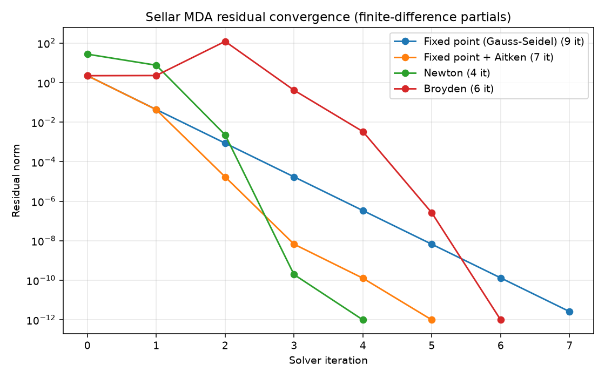

# Sellar MDA — an in-class OpenMDAO walkthrough (instructor guide)

> **Instructor note.** This is the teaching script for building the Sellar
> multidisciplinary analysis (MDA) live, from an empty file, as the opening of
> Lesson 2. It is *not* handed to students — they build it with you at the
> keyboard. Each step below has three bands: **Concept** (the OpenMDAO idea to
> land), **Type this** (the code to write), and **Say / point at** (what to narrate
> and the output you will get). The finished code lives in
> [`../sellar_mda.py`](../sellar_mda.py); each intermediate stage is a runnable
> snapshot in [`../steps/`](../steps).

**Goal.** Introduce OpenMDAO from scratch — its assumptions, its API, and its way
of representing a problem — by building the canonical
[Sellar problem](https://openmdao.org/newdocs/versions/latest/basic_user_guide/multidisciplinary_optimization/sellar.html)
up to a converged MDA, then solving that same coupled loop four ways. Sellar is the
right first vehicle because it has genuine **two-way coupling** between two
disciplines: the "one pass isn't enough — you need a solver" moment is unavoidable
and visible on screen.

**Where this sits.** Lesson 1 taught the DSM/XDSM and the vocabulary of shapes
(FUNC, SOLVER, GROUP, …) and how each maps to an OpenMDAO construct. Lesson 2's ASW
material ([`../../asw/`](../../asw)) then dissects *how* a coupled loop converges and
what it costs. This walkthrough is the bridge: it is the first time students write
OpenMDAO themselves, and it re-uses Lesson 1's picture and hands directly into the
ASW solver-cost story on a fresh, cleanly-coupled problem.

Run everything from the repository root with the `eng-des-opt-course` environment
active (`conda activate eng-des-opt-course`).

---

## Part 0 — How OpenMDAO thinks (whiteboard, before any code)

Land these five ideas *before* opening an editor. They are the assumptions that
make the rest obvious.

1. **A model is a graph of named variables, not a script of calls.** You never call
   one discipline from another. You *declare* each block's inputs and outputs by
   name; the framework owns the data vectors and decides execution. Wiring is done
   by matching names, not by passing arguments.

2. **The hierarchy is Problem → model (a Group) → Systems.** A `Problem` is the
   container you run. Its `model` is the top **`Group`**. A `Group` holds
   subsystems and owns the *connections* and the *solvers*. The leaves are
   **`Component`s** — the atoms that actually compute.

3. **Two kinds of component.** An **`ExplicitComponent`** computes outputs directly
   from inputs (`compute`: `y = f(x)`) — Lesson 1's green **FUNC**. An
   **`ImplicitComponent`** instead defines a residual `R(x, y) = 0` a solver must
   drive to zero — Lesson 1's salmon **IFUNC** (the ASW `Sizing` block). Today is
   all explicit components.

4. **A Group runs its subsystems once, in order — that is the key assumption.**
   Pure feed-forward models are done in a single pass. A **feedback edge (a cycle)**
   is *not* — it needs a **`nonlinear_solver`** on the Group to iterate to
   consistency. This is the whole reason MDA solvers exist, and it is exactly
   Lesson 1's "above the diagonal = feed-forward, below = feedback."

5. **Solver vs driver — different levels.** A `nonlinear_solver` lives *inside* a
   Group and drives a coupled loop to feasibility — Lesson 1's orange **SOLVER**
   pill. A `Problem.driver` (an optimizer or DOE) wraps the *whole* model — the blue
   **OPT/DOE** pill. Today we build the model and its solver; the driver is week 3.

**Map Sellar onto Lesson 1 now.** By the end we will have: two green **FUNC** boxes
(`d1`, `d2`) inside an orange **SOLVER** loop, three more **FUNC** boxes for the
objective and constraints, all inside one **GROUP**. That is precisely the minimal
two-discipline SOLVER picture drawn in Lesson 1 §6.5.

---

## Part 1 — The Sellar problem (whiteboard)

Two disciplines, each needing the other's output:

$$
\begin{aligned}
\textbf{Discipline 1:}\quad & y_1 = z_1^2 + z_2 + x - 0.2\,y_2 \\
\textbf{Discipline 2:}\quad & y_2 = \sqrt{y_1} + z_1 + z_2
\end{aligned}
$$

and, wrapped around the converged analysis, an objective and two constraints:

$$
\begin{aligned}
f    &= x^2 + z_2 + y_1 + e^{-y_2} \\
g_1  &= 3.16 - y_1 \le 0 \\
g_2  &= y_2 - 24 \le 0
\end{aligned}
$$

**Variables and their roles:**

| Symbol | Role | Default |
|---|---|---|
| `z = [z1, z2]` | shared (global) design variables — feed both disciplines | `[5, 2]` |
| `x` | local design variable — feeds Discipline 1 only | `1` |
| `y1` | coupling variable, **out of d1, into d2** | — |
| `y2` | coupling variable, **out of d2, into d1** | — |

**Draw the DSM.** Put `d1` then `d2` on the diagonal. `y1` flows `d1 → d2` — to the
*later* block, so it sits **above** the diagonal (feed-forward). `y2` flows
`d2 → d1` — back to the *earlier* block, so it sits **below** the diagonal
(feedback). That single below-diagonal edge is the coupled loop. This is the same
shape as Lesson 1 §6.5's textbook SOLVER example — Sellar *is* that example.

**Contrast with ASW (why we bother with a second problem).** The ASW loop had a
*single implicit scalar state* (`W_TO`) closed by one residual. Sellar has *two
coupling variables passed between two disciplines* — a genuine Gauss–Seidel MDA.
Seeing the same solver ideas on both is the point: they generalize.

One practical detail: Discipline 2 takes `√y1`. A stray negative `y1` mid-iteration
would give a NaN, so we guard it — the same defensive move as the ASW loop's bounds.

---

## Part 2 — Discipline 1 as an ExplicitComponent

*(snapshot: [`../steps/step_1_discipline1.py`](../steps/step_1_discipline1.py))*

**Concept.** The smallest useful OpenMDAO object: one `ExplicitComponent`. Three
methods matter — `setup` (declare variables), `setup_partials` (declare
derivatives), `compute` (do the math).

**Type this.**

```python
import numpy as np
import openmdao.api as om


class SellarDis1(om.ExplicitComponent):
    """Discipline 1: y1 = z1**2 + z2 + x - 0.2 * y2."""

    def setup(self):
        self.add_input("z", val=np.zeros(2))   # [z1, z2] shared design variables
        self.add_input("x", val=0.0)           # local design variable
        self.add_input("y2", val=1.0)          # coupling variable IN (from d2)
        self.add_output("y1", val=1.0)         # coupling variable OUT (to d2)

    def setup_partials(self):
        self.declare_partials("*", "*", method="fd")

    def compute(self, inputs, outputs):
        z1 = inputs["z"][0]
        z2 = inputs["z"][1]
        x = inputs["x"]
        y2 = inputs["y2"]
        outputs["y1"] = z1**2 + z2 + x - 0.2 * y2
```

Then run it standalone:

```python
prob = om.Problem()
prob.model.add_subsystem("d1", SellarDis1(), promotes=["*"])
prob.setup()
prob.set_val("z", [5.0, 2.0]); prob.set_val("x", 1.0); prob.set_val("y2", 1.0)
prob.run_model()
print(prob.get_val("y1"))
```

**Say / point at.**
- Every `add_input`/`add_output` needs a `val` (or shape): the framework allocates
  the vectors up front, so it must know sizes. `z` is a length-2 array; the rest are
  scalars.
- **`y2` is an input here even though Discipline 2 will produce it.** A component
  never knows where its inputs come from — that decoupling is what lets us snap
  disciplines together later.
- `declare_partials("*", "*", method="fd")` says "finite-difference every
  derivative." Cheap to write; we revisit *analytic* derivatives at the very end.
- `setup` / `run_model` / `get_val` is the universal rhythm: build, run, read.
- Output: `y1 = 27.8000` — check by hand: `25 + 2 + 1 − 0.2·1 = 27.8`.

---

## Part 3 — Discipline 2

*(snapshot: [`../steps/step_2_discipline2.py`](../steps/step_2_discipline2.py))*

**Concept.** A second component, and the naming that will wire the two together.

**Type this.**

```python
class SellarDis2(om.ExplicitComponent):
    """Discipline 2: y2 = sqrt(y1) + z1 + z2."""

    def setup(self):
        self.add_input("z", val=np.zeros(2))
        self.add_input("y1", val=1.0)          # coupling variable IN (from d1)
        self.add_output("y2", val=1.0)         # coupling variable OUT (to d1)

    def setup_partials(self):
        self.declare_partials("*", "*", method="fd")

    def compute(self, inputs, outputs):
        z1 = inputs["z"][0]
        z2 = inputs["z"][1]
        y1 = inputs["y1"]
        if y1.real < 0.0:                      # guard the sqrt against a negative y1
            y1 *= -1
        outputs["y2"] = y1**0.5 + z1 + z2
```

**Say / point at.**
- `y1` is d2's **input** and d1's **output**. The shared *name* `y1` is exactly what
  we will connect in the next step — no name coincidence, a deliberate contract.
- The `√` guard is the Sellar version of the ASW clamp/line-search: keep the math
  real while a solver is still far from the answer.
- Run standalone with `y1 = 1`, `z = [5, 2]`: `y2 = 1 + 5 + 2 = 8.0000`.

---

## Part 4 — Wire the cycle, run it WITHOUT a solver

*(snapshot: [`../steps/step_3_cycle_no_solver.py`](../steps/step_3_cycle_no_solver.py))*

**Concept.** Assemble a `Group`, connect the two disciplines, and *see the default
one-pass behavior fail* on the feedback edge. This is the pedagogical heart of the
whole session.

**Type this.**

```python
prob = om.Problem()
model = prob.model

# Shared design inputs promoted so one value feeds both disciplines.
model.add_subsystem("d1", SellarDis1(), promotes_inputs=["z", "x"])
model.add_subsystem("d2", SellarDis2(), promotes_inputs=["z"])

# Internal coupling wired explicitly so the data flow is visible.
model.connect("d1.y1", "d2.y1")   # feed-forward
model.connect("d2.y2", "d1.y2")   # feedback — the loop

model.set_input_defaults("x", val=1.0)
model.set_input_defaults("z", val=np.array([5.0, 2.0]))

prob.setup()
prob.run_model()   # no nonlinear solver -> a single pass, d1 then d2
```

**Say / point at.**
- **Two wiring mechanisms, shown side by side on purpose.** The *shared inputs*
  `z`, `x` are **promoted** (same name → same variable, set once). The *internal
  couplings* are wired with explicit **`connect(src, tgt)`** so the data flow is
  literally on screen — this matches the ASW group in
  `ex_01_asw/methods/group.py`. In Part 7 we switch the couplings to promotion too
  (the idiomatic form the official docs use).
- Run it and read the output:

  ```text
  After one pass:      y1 = 27.8000,  y2 = 12.2726
  Re-evaluating d1 with that y2 gives  y1 = 25.5455
    -> mismatch of 2.2545: the feedback loop is NOT converged.
  ```

- **The point:** OpenMDAO did exactly one pass — `d1` (with the initial `y2 = 1`),
  then `d2` (with `d1`'s fresh `y1`) — and stopped. The disciplines disagree. It did
  **not** raise an error; it silently returned inconsistent numbers. Nothing is
  wrong with the code — the *model* has a feedback edge and a single pass cannot
  close it. That is the below-diagonal edge from Lesson 1, made real.

---

## Part 5 — Add the MDA solver → the loop converges

*(snapshot: [`../steps/step_4_mda_nlbgs.py`](../steps/step_4_mda_nlbgs.py))*

**Concept.** One line turns the single pass into a real MDA.

**Type this.**

```python
model.nonlinear_solver = om.NonlinearBlockGS()
model.nonlinear_solver.options["iprint"] = 2   # print the residual each sweep
```

**Say / point at.**
- **Nonlinear Block Gauss–Seidel** = evaluate `d1`, pass `y1` to `d2`, pass `y2`
  back to `d1`, repeat until the values stop moving. That is the *same fixed-point
  idea* as Raymer's ASW hand-iteration — only now two coupling variables are driven
  to consistency instead of one scalar.
- With `iprint=2` the residual norm marches down the screen:

  ```text
  NL: NLBGS 1 ; 29.0742299 1
  NL: NLBGS 2 ; 2.26505979 0.0779060975
  NL: NLBGS 3 ; 0.0438762115 0.00150911001
  ...
  NL: NLBGS 8 ; 1.32523072e-10 4.55809395e-12
  NL: NLBGS Converged

  Converged MDA:  y1 = 25.5883,  y2 = 12.0585
  ```

- **This converged model is the Sellar MDA — today's target.** It is Lesson 1's
  orange SOLVER pill wrapping the loop. Point out that the residual falls by a
  roughly constant *factor* each sweep (linear convergence) — the straight-ish line
  we will see again in Part 8.

---

## Part 6 — Inspect the live model (N2 + variable lists)

*(snapshot: [`../steps/step_5_inspect_n2.py`](../steps/step_5_inspect_n2.py))*

**Concept.** OpenMDAO draws the DSM for you, from the live model.

**Type this.**

```python
om.n2(prob, outfile="sellar_n2.html", show_browser=False)
prob.model.list_inputs(prom_name=True)
prob.model.list_outputs(prom_name=True)
```

**Say / point at.**
- Open [`../outputs/sellar_n2.html`](../outputs/sellar_n2.html). It is the **same N2
  you met in Lesson 1**, generated from *this* model. Click `d2` and find the `y2`
  connection running **below the diagonal** — the feedback edge — and the solver box
  drawn around the loop. This is why the N2 is the diagram you keep open while
  building: it can never drift from the code.
- `list_inputs`/`list_outputs` dump every variable the framework allocated, with
  promoted names — the fastest way to check "did that connect the way I meant?"

---

## Part 7 — Add the objective and constraints

*(snapshot: [`../steps/step_6_obj_cons.py`](../steps/step_6_obj_cons.py))*

**Concept.** Turn the analysis into an optimizable model, and adopt the idiomatic
group structure while doing it.

**Type this.**

```python
class SellarMDA(om.Group):
    def setup(self):
        # Coupled disciplines in their own subgroup so the solver wraps only the loop.
        cycle = self.add_subsystem("cycle", om.Group(), promotes=["*"])
        cycle.add_subsystem("d1", SellarDis1(),
                            promotes_inputs=["x", "z", "y2"], promotes_outputs=["y1"])
        cycle.add_subsystem("d2", SellarDis2(),
                            promotes_inputs=["z", "y1"], promotes_outputs=["y2"])
        cycle.nonlinear_solver = om.NonlinearBlockGS()

        self.set_input_defaults("x", val=1.0)
        self.set_input_defaults("z", val=np.array([5.0, 2.0]))

        self.add_subsystem("obj_cmp",
            om.ExecComp("obj = x**2 + z[1] + y1 + exp(-y2)", z=np.array([0.0, 0.0]), x=0.0),
            promotes=["x", "z", "y1", "y2", "obj"])
        self.add_subsystem("con_cmp1", om.ExecComp("con1 = 3.16 - y1"), promotes=["con1", "y1"])
        self.add_subsystem("con_cmp2", om.ExecComp("con2 = y2 - 24.0"), promotes=["con2", "y2"])
```

**Say / point at.**
- **Two structural moves, both worth naming:**
  1. **Wrap `d1`+`d2` in a `cycle` subgroup and put the solver on it.** A solver's
     job is the *loop only*; the objective and constraints are pure feed-forward and
     must sit outside it, or the solver would pointlessly re-evaluate them each
     sweep.
  2. **Switch the couplings from `connect` to `promotes`.** Promotion connects
     same-named variables automatically — `d1`'s output `y1` to `d2`'s input `y1`,
     `d2`'s output `y2` to `d1`'s input `y2`. It is the idiomatic OpenMDAO style and
     how the official docs write Sellar; `promotes=["*"]` on the cycle also lifts
     `y1`/`y2` up so the obj/con components can read them by name.
- **`ExecComp` is a one-line `ExplicitComponent`** — a green FUNC box you get without
  writing a class. Perfect for algebra like the objective and constraints.
- Run it (`prob = om.Problem(model=SellarMDA())`, `setup`, `run_model`):

  ```text
  y1   = 25.5883
  y2   = 12.0585
  obj  = 28.5883
  con1 = -22.4283
  con2 = -11.9415
  ```

- The model now has everything an optimizer needs — design variables `z`, `x`; an
  objective; constraints. Adding `prob.driver = om.ScipyOptimizeDriver()` and
  `add_design_var/add_objective/add_constraint` is the blue OPT pill from Lesson 1
  §6.1 — that is **week 3**, and a good place to stop today.

---

## Part 8 — One MDA, four solvers (hand off to the ASW lesson)

*(snapshot: [`../steps/step_7_solver_compare.py`](../steps/step_7_solver_compare.py))*

**Concept.** The same coupled loop, solved four ways — exactly the experiment
`asw/compare_solvers.py` runs on the ASW loop, now on Sellar.

**Type this (the solver factory; swap it onto `cycle`).**

```python
def make_nonlinear_solver(kind):
    if kind == "nlbgs":
        solver = om.NonlinearBlockGS()
    elif kind == "nlbgs_aitken":
        solver = om.NonlinearBlockGS(); solver.options["use_aitken"] = True
    elif kind == "newton":
        solver = om.NewtonSolver(solve_subsystems=False)
    elif kind == "broyden":
        solver = om.BroydenSolver(); solver.options["state_vars"] = ["y1", "y2"]
    solver.options["maxiter"] = 50
    solver.options["atol"] = 1e-10
    solver.options["rtol"] = 1e-12
    return solver
```

Newton and Broyden take a linearized step, so the cycle also needs a linear solver:

```python
if kind in ("newton", "broyden"):
    cycle.linear_solver = om.DirectSolver()
```

**Say / point at.**
- Run it. All four land on the *same* answer; only the iteration count differs:

  ```text
  Fixed point (Gauss-Seidel) iters=  9  y1=25.5883  y2=12.0585
  Fixed point + Aitken       iters=  7  y1=25.5883  y2=12.0585
  Newton                     iters=  4  y1=25.5883  y2=12.0585
  Broyden                    iters=  6  y1=25.5883  y2=12.0585
  ```

  and the residual histories, plotted to
  [`../outputs/sellar_convergence.png`](../outputs/sellar_convergence.png):

  

- **The answer is a property of the model, not the solver** — every method converges
  to the same `y1`, `y2`. What differs is the *path* and the *cost*: Gauss–Seidel is
  linear (most sweeps), Aitken accelerates it for free, Newton takes the fewest
  iterations but must linearize each step, Broyden sits in between.
- This is *exactly* the ASW story. Hand off to
  [`../../asw/docs/lesson_02_iterative_methods.md`](../../asw/docs/lesson_02_iterative_methods.md)
  for the fuller accounting — function vs derivative evaluations, and why "fewest
  iterations" is not "cheapest."

---

## Closing — from finite difference to analytic (JAX) gradients

Everywhere above we wrote `declare_partials("*", "*", method="fd")`: OpenMDAO gets
each component's derivatives by *perturbing inputs and re-running `compute`*. That is
fine for a toy, but it costs extra evaluations that grow with the number of inputs,
and it is only as accurate as the step size.

The ASW example takes the other road: it writes each discipline's physics in **JAX**
(`ex_01_asw/methods/disciplines.py`) and fills `compute_partials` with a single
`jax.jacobian` call (`ex_01_asw/methods/components.py`) — derivatives that are
**analytic, exact, and cheap**. That is the entire subject of Lesson 2 §4–5 (Newton
with JAX vs finite-difference partials; analytic total derivatives for design
sensitivity) and the reason this course builds its real models on JAX + OpenMDAO.
Sellar is where the API becomes second nature; the ASW loop is where the *cost* of
derivatives starts to matter.

---

## Try it

1. In Part 4, **reorder** the disciplines (`add_subsystem("d2", ...)` before `d1`)
   and re-render the N2. Which edge is now below the diagonal, and does the one-pass
   answer change? What does that say about execution order vs. the coupled loop?
2. Loosen the solver tolerances in `make_nonlinear_solver` (`atol`, `rtol`) and
   watch the iteration counts drop. Where is the trade-off between speed and a
   trustworthy answer?
3. Rewrite the Part 4 cycle to use **promotion instead of `connect`** for `y1`/`y2`
   (as in Part 7's `cycle`). Confirm the N2 and the converged answer are identical —
   two spellings of the same wiring.
4. Add a driver: `prob.driver = om.ScipyOptimizeDriver()`, then
   `model.add_design_var("x", lower=0, upper=10)`,
   `add_design_var("z", lower=0, upper=10)`, `add_objective("obj")`,
   `add_constraint("con1", upper=0)`, `add_constraint("con2", upper=0)`, and
   `run_driver()`. You have just wrapped the MDA in the blue OPT pill — a preview of
   week 3. (Expect `x → 0`, `z → [1.98, 0]`, `obj ≈ 3.18`.)
