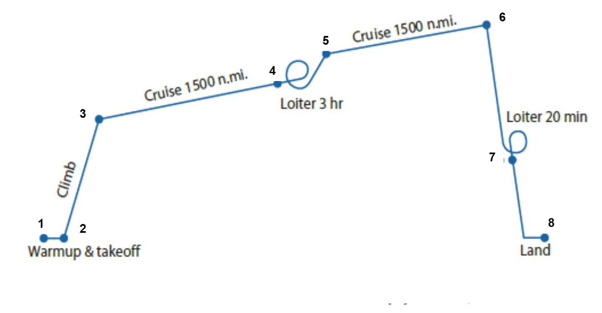

# Step-by-Step Example: Sizing a Notional ASW Aircraft

A minimal takeoff-gross-weight (TOGW) sizing example for a **notional Anti-Submarine Warfare (ASW)** aircraft, using the classic fuel-fraction / empty-weight-fraction method. This example follows **Raymer, *Aircraft Design: A Conceptual Approach* (7th ed.), Section 3.6**. The narrative stays synchronized with the **OpenMDAO + JAX** model in [`../methods/`](../methods) — pure-JAX physics in `disciplines.py`, wrapped as OpenMDAO components in `components.py`, assembled into a group in `group.py`, with the `solve()` entry point in `config.py` — and the interactive Streamlit app in `apps/streamlit/app.py`. The same model is dissected in the course lessons on [design structure matrices](../../../../../lessons/lesson_01_dsm/docs/lesson_01_dsm.md) and [iterative methods](../../../../../lessons/lesson_02_iterative_methods/asw/docs/lesson_02_iterative_methods.md).

> **Conceptual sketch:** we adopt a **canard, high-wing** configuration for this concept.

> **Teaching note:** every numerical result shown below comes from the baseline kernel and is rounded only for display.

## Learning Objectives

After working through this example, students should be able to:

1. Translate an ASW mission statement into explicit weight-loss segments.
2. Use Breguet range and endurance relations to compute cruise and loiter weight ratios.
3. Assemble the mission fuel fraction and convert it to a usable fuel-weight fraction.
4. Apply the statistical empty-weight regression and solve the TOGW equation by fixed-point iteration.
5. Explore how changing one assumption propagates through the intermediate calculations and final TOGW.

## Run the Interactive App

From the repository root, install the package and launch the Streamlit app:

```bash
python -m pip install -e .
python -m streamlit run apps/streamlit/app.py
```

The app reproduces the full walkthrough and the interactive sensitivity study from the exact same kernel used in this narrative.

## Mission Requirements

- **Loiter for 3 hours** at **1500 nm** from the takeoff point, then **return to base**, followed by another **20 min loiter** before landing.
- Cruise Mach number: **M = 0.6**
- Mission equipment weight: **10,000 lb**
- Four-man crew totaling **800 lb**
- **Propulsion:** a **high-bypass-ratio turbofan**, with TSFC read from **Raymer Table 3.3** (cruise **0.5 1/hr**, loiter **0.4 1/hr**).

## Mission Profile and Fixed-Point View

| Mission profile | Fixed-point XDSM |
|---|---|
|  |  |

The mission is broken into **8 numbered weight points** (1 → 8), i.e. **7 segments**:

| # | Segment | Description |
|---|---------|-------------|
| 1 → 2 | Warmup & takeoff | Historical ratio |
| 2 → 3 | Climb | Historical ratio |
| 3 → 4 | Cruise | 1500 nm outbound |
| 4 → 5 | Loiter | 3 hr on station |
| 5 → 6 | Cruise | 1500 nm return |
| 6 → 7 | Loiter | 20 min prelanding |
| 7 → 8 | Landing | Historical ratio |

*(Descent is folded into cruise, fraction = 1.0.)*

The XDSM makes the multidisciplinary structure explicit: **aerodynamics** and **propulsion** feed the **mission-fuel** analysis (which supplies the fuel fraction), **structures** supplies the empty-weight fraction from the current TOGW, and the implicit **sizing** residual closes the loop — the nonlinear solver drives the single `structures ↔ sizing` feedback until the residual vanishes. See [Lesson 1](../../../../../lessons/lesson_01_dsm/docs/lesson_01_dsm.md) for how to read this diagram.

---

## The Sizing Equation

Takeoff gross weight is expressed as fixed (payload + crew) weight divided by what remains after subtracting the empty-weight and fuel-weight fractions:

$$W_{TO} = \frac{W_{\text{fixed}}}{1 - \dfrac{W_{\text{empty}}}{W_{TO}} - \dfrac{W_{\text{fuel}}}{W_{TO}}}$$

- **$W_{\text{fixed}}$** is known: $10{,}000 + 800 = \mathbf{10{,}800\ \text{lb}}$.
- **$W_{\text{fuel}}/W_{TO}$** comes from the mission fuel fraction (Steps 1–4 below).
- **$W_{\text{empty}}/W_{TO}$** comes from the statistical empty-weight regression (Step 5).

Because $W_{\text{empty}}/W_{TO}$ itself depends on $W_{TO}$, the equation is solved by **iteration** (Step 6).

---

## Mission Fuel Fraction (MFF)

> **Assumption:** weight change during the mission is due to **fuel consumption only**.

The mission fuel fraction is the product of the individual segment weight ratios:

$$\frac{W_8}{W_1} = \prod_{i=1}^{7} \frac{W_{i+1}}{W_i}, \qquad \mathrm{MFF} = 1 - \frac{W_8}{W_1}$$

Cruise and loiter segments use the **Breguet** equations; the short segments use historical constants.

### Step 1 — Simple-estimate segments (constants)

| Segment | Ratio | Value |
|---------|-------|-------|
| Warmup & takeoff | $W_2/W_1$ | 0.970 |
| Climb | $W_3/W_2$ | 0.985 |
| Descent (part of cruise) | — | 1.000 |
| Landing | $W_8/W_7$ | 0.995 |

### Step 2 — Cruise segments (Breguet range)

$$\frac{W_{i+1}}{W_i} = \exp\!\left(\frac{-R\,\cdot\,\mathrm{sfc}}{V\,(L/D)}\right)$$

The maximum lift-to-drag ratio is **estimated from the wetted aspect ratio** using Raymer Eq. 3.12 / Fig. 3.5 — it is computed, not entered:

$$(L/D)_{\max} = K_{LD}\,\sqrt{AR_{\text{wet}}}, \qquad AR_{\text{wet}} = \frac{AR}{S_{\text{wet}}/S_{\text{ref}}}, \qquad K_{LD} = 14\ \text{(military jet)}$$

**Given / estimated:**

| Quantity | Value | Notes |
|----------|-------|-------|
| Range $R$ | 9,114,000 ft | 1500 nm outbound or return |
| Mach | 0.6 | |
| Cruise altitude | 30,000 ft | typical; the only atmospheric input |
| Speed of sound | $a = 994.85$ ft/s | ICAO standard atmosphere at 30,000 ft, computed by [`ambiance`](https://pypi.org/project/ambiance/) — not entered |
| Cruise speed | $V = 0.6 \times 994.85 = 596.91$ ft/s | |
| sfc | 0.5 lb/hr/lb = 0.000139 lb/s/lb | high-bypass turbofan (Table 3.3) |
| Aspect ratio | $AR = 7.0$ | combined wing + canard |
| Wetted-area ratio | $S_{\text{wet}}/S_{\text{ref}} = 5.5$ | Fig. 3.6 |
| Wetted aspect ratio | $AR_{\text{wet}} = 7.0/5.5 = 1.2727$ | |
| $K_{LD}$ | 14 | military jet (Fig. 3.5) |
| $(L/D)_{\max}$ | $14\sqrt{1.2727} = 15.79$ | Eq. 3.12 |
| Cruise $L/D$ | $0.866\,(L/D)_{\max} = 13.68$ | Mach-0.6 cruise factor |

$$\frac{W_4}{W_3} = \exp\!\left(\frac{-9{,}114{,}000 \times 0.000139}{596.91 \times 13.68}\right) = \exp(-0.1551) = \mathbf{0.8564}$$

The return cruise (Segment 5) is identical: $W_6/W_5 = \mathbf{0.8564}$.

### Step 3 — Loiter segments (Breguet endurance)

$$\frac{W_{i+1}}{W_i} = \exp\!\left(\frac{-E\,\cdot\,\mathrm{sfc}}{L/D}\right)$$

**Given / estimated:** loiter sfc = 0.4 lb/hr/lb = 0.000111 lb/s/lb (Table 3.3), and loiter is flown at best endurance so $L/D = (L/D)_{\max} = 15.79$.

**3-hr loiter (Segment 4):** $E = 3.0\ \text{hr} = 10{,}800\ \text{s}$

$$\frac{W_5}{W_4} = \exp\!\left(\frac{-10{,}800 \times 0.000111}{15.79}\right) = \exp(-0.0760) = \mathbf{0.9268}$$

**20-min loiter (Segment 6):** $E = 20\ \text{min} = 1{,}200\ \text{s}$

$$\frac{W_7}{W_6} = \exp\!\left(\frac{-1{,}200 \times 0.000111}{15.79}\right) = \exp(-0.00844) = \mathbf{0.9916}$$

### Step 4 — Assemble the mission fuel fraction

$$\frac{W_8}{W_1} = 0.970 \times 0.985 \times 0.8564 \times 0.9268 \times 0.8564 \times 0.9916 \times 0.995 \approx \mathbf{0.6408}$$

The **fuel weight fraction** adds allowances for reserve fuel (5 %) and trapped/unusable fuel (1 %):

$$\frac{W_{\text{fuel}}}{W_{TO}} = (1 + 0.05 + 0.01)\left(1 - 0.6408\right) \approx \mathbf{0.3808}$$

---

## Step 5 — Empty-Weight Fraction

The empty-weight fraction is taken from a **statistical regression** of historical aircraft (Raymer, military cargo/bomber category), scaled by a **material factor** $K_{\text{mat}}$:

$$\frac{W_{\text{empty}}}{W_{TO}} = 0.93\,W_{TO}^{-0.07}\;K_{\text{mat}}, \qquad K_{\text{mat}} = \begin{cases} 1.00 & \text{metal (baseline)} \\ 0.95 & \text{composite} \end{cases}$$

A **composite** airframe (Raymer) trims the empty-weight fraction by 5 %. It decreases slowly as the aircraft grows, which is why the sizing equation must be iterated.

---

## Step 6 — TOGW Iteration

Guess $W_{TO}$, evaluate the empty-weight fraction, then recompute

$$W_{TO}^{\text{new}} = \frac{10{,}800}{1 - 0.3808 - W_{\text{empty}}/W_{TO}}$$

and repeat until the change is negligible.

| Iteration | Guess $W_{TO}$ (lb) | $W_{\text{fixed}}$ (lb) | Fuel frac. | Empty-wt frac. | Empty weight (lb) | New $W_{TO}$ (lb) | Difference (lb) |
|---:|---:|---:|---:|---:|---:|---:|---:|
| 1 | 50,000.0 | 10,800.0 | 0.3808 | 0.4361 | 21,803.4 | 58,970.6 | 8,970.6 |
| 2 | 58,970.6 | 10,800.0 | 0.3808 | 0.4311 | 25,419.9 | 57,400.9 | -1,569.7 |
| 3 | 57,400.9 | 10,800.0 | 0.3808 | 0.4319 | 24,790.1 | 57,650.6 | 249.7 |
| 4 | 57,650.6 | 10,800.0 | 0.3808 | 0.4317 | 24,890.3 | 57,610.3 | -40.3 |
| 5 | 57,610.3 | 10,800.0 | 0.3808 | 0.4318 | 24,874.1 | 57,616.8 | 6.5 |
| 6 | 57,616.8 | 10,800.0 | 0.3808 | 0.4318 | 24,876.7 | 57,615.7 | -1.0 |
| 7 | 57,615.7 | 10,800.0 | 0.3808 | 0.4318 | 24,876.3 | 57,615.9 | 0.2 |

The iteration converges to **$W_{TO} \approx 57{,}616\ \text{lb}$**.

---

## Step 7 — Sanity Check

Compare the estimate against a real ASW aircraft of the same class — the **Lockheed S-3 Viking**, whose maximum takeoff weight is about **$W_{TO} = 52{,}539$ lb**.

Our estimate (**57,616 lb**) is about **9.7 %** above the S-3 Viking, which keeps the result in the right ballpark for a first-order conceptual-sizing exercise.

---

## Using the Interactive App

The Streamlit app mirrors the same sequence as the hand calculation, then adds an interactive sensitivity study built on the exact same kernel.

### Controls students can vary

- **Mission (sliders):** one-way cruise range, **cruise altitude**, mission-equipment weight, and on-station loiter endurance — dragged directly on slider bars. Cruise altitude sets the ICAO standard atmosphere through the [`ambiance`](https://pypi.org/project/ambiance/) package; the resulting speed of sound, density, temperature, and pressure appear in the derived-values table.
- **Propulsion (number fields):** cruise and loiter TSFC.
- **Aerodynamics (number fields):** wing aspect ratio and wetted-area ratio $S_{\text{wet}}/S_{\text{ref}}$. Maximum $L/D$ is **computed** from these via Eq. 3.12 — it is not entered.
- **Structure (radio):** switch between **metal** and **composite** (composite scales the empty-weight fraction by 0.95).
- **Solver controls:** the nonlinear solver (fixed point, fixed point + Aitken, Newton, or Broyden — all converge to the same TOGW; see [Lesson 2](../../../../../lessons/lesson_02_iterative_methods/asw/docs/lesson_02_iterative_methods.md)), initial TOGW guess, convergence tolerance, and maximum iterations. The **iteration cap** applies to the nonlinear solver itself; the **tolerance** is the acceptance band on the sizing residual $W_{TO}(1 - W_f/W_{TO} - W_e/W_{TO}) - W_{\text{fixed}}$, which is measured in pounds. A run that fails either test is reported as a warning rather than returned as an answer.

The remaining Raymer 3.6 assumptions — cruise Mach, crew weight, prelanding loiter, the historical segment ratios, $K_{LD}$, the cruise/loiter $L/D$ factors, and the fuel allowances — are held fixed at their baseline values. Speed of sound is deliberately **not** a control: it, along with the reported density, temperature, and pressure, is the standard atmosphere's answer to the cruise-altitude slider. Only $a$ reaches the sizing loop — Raymer 3.6 sizes from weight fractions, so the other three are context, not inputs.

### What changes after a recompute?

Every click of **Recompute** reruns the full solve from the currently visible inputs. That means the derived cruise quantities, segment ratios, mission fuel fraction, empty-weight fraction history, final TOGW breakdown, iteration table, convergence plots, and final sensitivity plot all update together.

### Sensitivity analysis

The app's sensitivity panel varies **one selected input at a time** across an **absolute band** — you set the start and end values directly, not a percentage around the current point — reruns the full TOGW solve for each sample, and plots the resulting final TOGW. The baseline app state sweeps **one-way cruise range from 1,000 to 2,000 nm** in **9 samples**, and students can redirect that sweep to **cruise altitude, mission-equipment weight, aspect ratio, or cruise TSFC**. The altitude trade is worth a look for a different reason than range: it rises steadily through the troposphere as colder air slows the Mach-0.6 cruise, then goes flat above the 36,089 ft tropopause, where the standard atmosphere holds temperature — and so the speed of sound — constant. Switching the sweep input loads that input's own default band.

The band is absolute for a reason. Range is the input whose trade is most strongly **nonlinear**, and a narrow percentage band hides that: over ±10 % about 1,500 nm the curve is visually a straight line. Across the full 1,000–2,000 nm band the convexity is obvious:

| One-way range [nm] | 1,000 | 1,250 | 1,500 | 1,750 | 2,000 |
| --- | --- | --- | --- | --- | --- |
| $W_{TO}$ [lb] | 42,801 | 49,365 | 57,616 | 68,219 | 82,215 |
| Cost of the previous 250 nm [lb] | — | 6,565 | 8,251 | 10,603 | 13,996 |

Doubling the range **nearly doubles the aircraft** (1.92×), and the marginal cost of range more than doubles across the band. This is the sizing spiral compounding: more range means more fuel, more fuel means a heavier aircraft, and a heavier aircraft burns more fuel to fly the same distance. The loop amplifies itself, and $W_{TO}$ climbs faster than linearly.

### Where the model stops working

Push the range far enough and the denominator $1 - W_f/W_{TO} - W_e/W_{TO}$ closes on zero: fuel and structure consume the entire aircraft and nothing is left to carry the crew and mission equipment. For the Raymer 3.6 baseline that happens a little past **3,000 nm**, where the fixed point started from 50,000 lb runs away instead of converging. The app caps the range slider and the sweep band at 3,000 nm; beyond that the solve raises `SizingDivergedError` and the app reports it as a warning, keeping the last valid result on screen. A much heavier initial guess still finds a (very heavy) solution for a few hundred nm more — a good illustration that a fixed point is only **locally** convergent — until that root disappears too.

A practical caution for the aspect-ratio sweep: this Class I method raises $L/D$ with aspect ratio through Eq. 3.12 but carries **no structural weight penalty** for a longer, thinner wing. TOGW therefore falls monotonically with AR in the app, with no optimum. The real trade needs a wing-weight model, which conceptual sizing at this level does not have.

---

## Summary of the Method

1. Write $W_{TO} = W_{\text{fixed}} / (1 - W_e/W_{TO} - W_f/W_{TO})$.
2. Get $W_f/W_{TO}$ from the **mission fuel fraction** (product of segment ratios; Breguet for cruise/loiter, constants for the rest), then scale it by reserve and trapped-fuel allowances.
3. Get $W_e/W_{TO}$ from the **historical regression** (scaled by 0.95 for a composite airframe).
4. **Iterate** $W_{TO}$ to convergence.
5. **Sanity-check** the result against a comparable aircraft and explore sensitivity with the interactive app.
