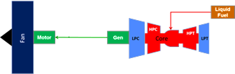
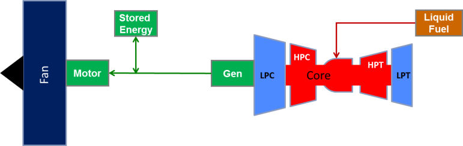
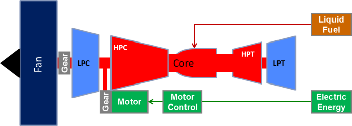

# Electric Drive Train (EDT) Energy Example — SOA Components

**Source:** *Examples – Design of Electrified Propulsion Aircraft*, J. Lents.
Worksheet: **`RO EDT Example SOA`** — *"Electric Drive Train Energy Example with State of the Art (SOA) Component Performance – Fixed Component Efficiencies."*

This worksheet fixes a mission and a set of powertrain component characteristics, then
compares the energy use of several powertrain architectures:

1. [Conventional](#1-conventional-powertrain)
2. [Turboelectric, No Battery](#2-turboelectric-no-battery)
3. [Turboelectric, With Battery](#3-turboelectric-with-battery)
4. [Full Mission Parallel Hybrid](#4-full-mission-parallel-hybrid)
5. [Electric Boost Parallel Hybrid](#5-electric-boost-parallel-hybrid)

Each architecture reuses the same mission and shared component assumptions below, and every
architecture's energy is compared back to the Conventional baseline.

> **Two corrections vs. the original spreadsheet** (details at each site):
> 1. **Total-energy double-count.** The battery-bearing blocks (§3–§5) had `Total = GT + Battery/η_bat`, but the battery energy already includes the `/η_bat` loss — corrected to `Total = GT + Battery`.
> 2. **§5 motor sizing.** The Electric-Boost motor weight was sized from the *Descent* row (`AP17`); corrected to the *Climb* boost row (`AP15`) to match §3–§4.

---

## Shared Assumptions (Component Characteristics)

These parameters (worksheet cells `C2:C9`) are shared across all architectures. Named
cells are given in the **Name** column because later formulae reference them by name.

| Parameter | Name | Cell | Value | Formula |
|-----------|------|------|-------|---------|
| Gas Turbine (GT) Specific Power (HP/lbm) | `GT_SP` | C2 | 5 | input |
| Motor & Drive Specific Power (kW/kg) | `Motor_SP` | C3 | 3.75 | `=1/(1/10+1/6)` |
| Gen & Rect Specific Power (kW/kg) | `Gen_SP` | C4 | 1.7647 | `=1/(1/2+1/15)` |
| Drive Train Specific Power (kW/kg) | — | C5 | 1.2000 | `=1/(1/Motor_SP+1/Gen_SP)` |
| Battery Specific Energy (Wh/kg) | `Bat_SE` | C6 | 175 | input |
| Battery Min State of Charge (SOC) | `Bat_MaxDD` | C7 | 0.8 | input |
| Battery Efficiency | `Bat_Eff` | C8 | 0.96 | input |
| Battery C-rate | `Bat_Crate` | C9 | 4 | input |

There are also two hybridization inputs used by the hybrid architectures:

| Parameter | Name | Cell | Value |
|-----------|------|------|-------|
| % Battery Hybrid | `HybPrt` | Q9 | 0.2 |
| Electric Boost (TO & Climb) | — | AK9 | 0.1 |
| Efficiency Improvement (TO, Climb & Cruise) | — | AL9 | 1.03 |

### Fixed physical / unit-conversion constants (hard-coded in the formulae)

| Constant | Meaning |
|----------|---------|
| `18400` | Fuel lower heating value, BTU/lbm |
| `2546.669` | Power conversion, BTU/hr per HP |
| `3.412142` | Energy conversion, BTU per Wh (divide, then `/1000` → kWh) |
| `1.341022` | HP per kW (HP → kW: divide) |
| `2.20462` | lbm per kg |
| `0.03` | incremental fuel-energy fraction to carry unit weight over the mission |
| `60` | minutes → hours |

### Mission Definition (inputs)

The mission is defined once, in the Conventional block (columns B–E), and reused by every
architecture:

| Mission Segment | Duration (min) | Power (HP) | GT Eff |
|-----------------|:--------------:|:----------:|:------:|
| Taxi Out | 10 | 100 | 0.10 |
| Takeoff | 1 | 2000 | 0.30 |
| Climb | 30 | 1600 | 0.30 |
| Cruise | 150 | 900 | 0.30 |
| Descent | 20 | 100 | 0.10 |
| Land | 3 | 500 | 0.25 |
| Taxi In | 10 | 100 | 0.10 |

Total mission time = `SUM(C13:C19)` = **224 min**.

---

## 1. Conventional Powertrain

**Worksheet columns B–H, rows 11–21.**

The conventional case is just a gas turbine driving the propulsor — there is **no powertrain
schematic** pasted over this column block in the spreadsheet (diagrams appear only over the
electrified architectures). For the Conventional architecture none of the component
specific-power/battery parameters enter the calculation; it depends only on the per-segment
**Power**, **Duration**, and **GT Eff** inputs plus the fixed unit-conversion constants.

### Column definitions & formulae

Formulae are shown for the first data row (row 13, "Taxi Out"); rows 14–19 are identical
with the row index changed.

| Col | Quantity | Units | Formula (row 13) | Symbolic form |
|-----|----------|-------|------------------|---------------|
| C | Duration | min | input | $\Delta t$ |
| D | Power | HP | input | $P$ |
| E | GT Eff | – | input | $\eta_{GT}$ |
| F | Engine SFC | lbm/hr/hp | `=1/(E13*18400/2546.669)` | $\text{SFC} = \dfrac{2546.669}{\eta_{GT}\cdot 18400}$ |
| G | Fuel Burn | lbm | `=D13*F13*C13/60` | $W_f = P \cdot \text{SFC} \cdot \dfrac{\Delta t}{60}$ |
| H | Energy | kWh | `=18400*G13/3.412142/1000` | $E = \dfrac{18400 \cdot W_f}{3.412142 \cdot 1000}$ |

**Totals (row 20):** `G20 =SUM(G13:G19)`, `H20 =SUM(H13:H19)`.

**Improvement vs. Conventional (row 21):** `H21 =($H20-H20)/$H20` $= 0$ — the conventional
case is the baseline by definition, and `$H20` is the reference denominator for every other
architecture's improvement row.

### Computed values

| Mission Segment | Duration (min) | Power (HP) | GT Eff | Engine SFC (lbm/hr/hp) | Fuel Burn (lbm) | Energy (kWh) |
|-----------------|:--------------:|:----------:|:------:|:----------------------:|:---------------:|:------------:|
| Taxi Out | 10 | 100 | 0.10 | 1.38406 | 23.0677 | 124.392 |
| Takeoff | 1 | 2000 | 0.30 | 0.46135 | 15.3784 | 82.928 |
| Climb | 30 | 1600 | 0.30 | 0.46135 | 369.0825 | 1990.280 |
| Cruise | 150 | 900 | 0.30 | 0.46135 | 1038.0444 | 5597.662 |
| Descent | 20 | 100 | 0.10 | 1.38406 | 46.1353 | 248.785 |
| Land | 3 | 500 | 0.25 | 0.55362 | 13.8406 | 74.635 |
| Taxi In | 10 | 100 | 0.10 | 1.38406 | 23.0677 | 124.392 |
| **Total Energy** | | | | | **1528.617** | **8243.076** |
| **Improvement vs. Conventional** | | | | | | **0** |

### Worked example — Cruise segment (row 16)

$$\text{SFC} = \frac{2546.669}{0.30 \times 18400} = 0.46135\ \frac{\text{lbm}}{\text{hr}\cdot\text{hp}}$$

$$W_f = 900 \times 0.46135 \times \frac{150}{60} = 1038.04\ \text{lbm}$$

$$E = \frac{18400 \times 1038.04}{3.412142 \times 1000} = 5597.66\ \text{kWh} \quad\checkmark$$

**Total mission:** 1528.6 lbm fuel / **8243.1 kWh** — the reference against which all
electrified architectures are compared.

---

## 2. Turboelectric, No Battery

**Worksheet columns I–M, rows 11–25.**

### Powertrain Schematic

The gas turbine core (LPC → HPC → combustor/Core → HPT → LPT) burns **liquid fuel** and
drives a **Generator**. All shaft power is converted to electricity, transmitted, and used
by a **Motor** that drives the **Fan**. There is **no battery** — the gas turbine is the
sole energy source. Because 100 % of the propulsive power flows through the full electric
drive train, its cumulative inefficiency directly increases the gas-turbine power (and
therefore the fuel burn) relative to the conventional case.

### Column definitions & formulae

Inputs come from the conventional block: **Duration** (col C), **Power** (col D, the fan
shaft power required), and per-segment **GT Eff** (col E). Formulae shown for row 13.

| Col | Quantity | Units | Formula (row 13) | Symbolic form |
|-----|----------|-------|------------------|---------------|
| I | EDT Eff | – | `=0.9*0.96*0.985*0.96*0.95` | $\eta_{EDT} = \eta_{G\&R}\,\eta_{M\&D}$ |
| J | GT Power | HP | `=D13/I13` | $P_{GT} = P_{\text{fan}} / \eta_{EDT}$ |
| K | GT SFC | lbm/hr/hp | `=F13` | same SFC curve as conventional |
| L | Fuel Burn | lbm | `=J13*K13*C13/60` | $W_f = P_{GT}\cdot \text{SFC}\cdot \dfrac{\Delta t}{60}$ |
| M | Total Energy | kWh | `=18400*L13/3.412142/1000` | $E = \dfrac{18400\,W_f}{3.412142\cdot 1000}$ |

#### Electric drive-train efficiency chain

$$\eta_{EDT} = \underbrace{(0.9 \times 0.96)}_{\eta_{G\&R}\,=\,0.864}\ \times\ \underbrace{(0.985 \times 0.96 \times 0.95)}_{\eta_{M\&D}\,=\,0.89832} = 0.77615$$

- **Generator & Rectifier** efficiency $\eta_{G\&R} = 0.9 \times 0.96 = 0.864$
- **Motor & Drive** efficiency $\eta_{M\&D} = 0.985 \times 0.96 \times 0.95 = 0.89832$

**Totals (row 20):** `L20 =SUM(L13:L19)`, `M20 =SUM(M13:M19)`.
**Improvement vs. Conventional (row 21):** `M21 =($H20-M20)/$H20`.

### Computed values

| Mission Segment | Duration (min) | Fan Power (HP) | EDT Eff | GT Power (HP) | GT SFC (lbm/hr/hp) | Fuel Burn (lbm) | Total Energy (kWh) |
|-----------------|:--------------:|:--------------:|:-------:|:-------------:|:------------------:|:---------------:|:------------------:|
| Taxi Out | 10 | 100 | 0.77615 | 128.841 | 1.38406 | 29.7207 | 160.269 |
| Takeoff | 1 | 2000 | 0.77615 | 2576.827 | 0.46135 | 19.8138 | 106.846 |
| Climb | 30 | 1600 | 0.77615 | 2061.461 | 0.46135 | 475.5307 | 2564.303 |
| Cruise | 150 | 900 | 0.77615 | 1159.572 | 0.46135 | 1337.4302 | 7212.102 |
| Descent | 20 | 100 | 0.77615 | 128.841 | 1.38406 | 59.4413 | 320.538 |
| Land | 3 | 500 | 0.77615 | 644.207 | 0.55362 | 17.8324 | 96.161 |
| Taxi In | 10 | 100 | 0.77615 | 128.841 | 1.38406 | 29.7207 | 160.269 |
| **Total Energy** | | | | | | **1969.490** | **10620.488** |
| **Improvement vs. Conventional** | | | | | | | **−28.84 %** |

The turboelectric drive train **increases** energy use by ~28.8 % versus conventional — the
price of routing all propulsion power through the generator/motor chain ($\eta_{EDT}=0.776$)
with no battery to shift energy sources.

### Weight & Payload Penalty (rows 22–25)

Adding the electric drive train adds mass, which displaces payload; carrying (or losing)
that payload costs additional mission energy.

| Col/Cell | Quantity | Units | Formula | Symbolic form |
|----------|----------|-------|---------|---------------|
| I23 | EDT Weight | lbm | `=J15/1.341022/C5*2.20462` | $W_{EDT} = \dfrac{P_{GT,\text{climb}}/1.341022}{\text{DriveTrain SP}} \times 2.20462$ |
| M23 | Total Weight / Payload Reduction | lbm | `=I23` | $= W_{EDT}$ |
| M24 | Energy to Carry Payload | kWh | `=18400*0.03*M23*SUM($C13:$C19)/60/3.412142/1000` | $E_{pl} = \dfrac{18400\cdot 0.03\cdot W\cdot \sum \Delta t / 60}{3.412142\cdot 1000}$ |
| M25 | Improvement (incl. payload) | – | `=($H20-M20-M24)/$H20` | baseline-relative |

Note: the EDT is sized on the **climb** operating point (`J15`, 2061.5 HP), using the shared
**Drive Train Specific Power** `C5` = 1.20 kW/kg. (Takeoff GT power is momentarily higher
but lasts only 1 min, so climb is the sizing point.)

| Quantity | Value |
|----------|-------|
| EDT Weight (= Total Weight = Payload Reduction) | 2824.18 lbm |
| Energy to Carry Payload | 1705.69 kWh |
| **Improvement vs. Conventional (incl. payload penalty)** | **−49.53 %** |

Accounting for added drive-train weight, the turboelectric-no-battery architecture is ~49.5 %
*worse* than conventional on total mission energy — establishing why a pure turboelectric
arrangement is only attractive when it enables other benefits (distributed propulsion,
boundary-layer ingestion, etc.) not captured in this energy bookkeeping.

---

## 3. Turboelectric, With Battery

**Worksheet columns N–X, rows 11–25.**

### Powertrain Schematic

Same series arrangement as the no-battery case (GT → Generator → Motor → Fan), but a
**Stored Energy** (battery) block is now tied to the motor bus. A fraction of the source
power — set by `HybPrt` (`Q9` = 0.2, i.e. 20 %) — is supplied by the battery instead of the
gas turbine, so the GT and its generator are sized for only 80 % of the source power.

### Column definitions & formulae

The source power is the fan power divided by the motor & drive efficiency. Formulae shown
for row 13.

| Col | Quantity | Units | Formula (row 13) | Symbolic form |
|-----|----------|-------|------------------|---------------|
| N | Motor & Drive Eff | – | `=0.985*0.96*0.95` | $\eta_{M\&D} = 0.89832$ |
| O | Source Power | HP | `=D13/N13` | $P_{src} = P_{\text{fan}} / \eta_{M\&D}$ |
| P | Gen & Rect Eff | – | `=0.9*0.96` | $\eta_{G\&R} = 0.864$ |
| Q | GT Power | HP | `=(1-HybPrt)*O13/P13` | $P_{GT} = (1-\phi)\,P_{src}/\eta_{G\&R}$ |
| R | GT SFC | lbm/hr/hp | `=F13` | same SFC curve as conventional |
| S | Fuel Burn | lbm | `=Q13*R13*C13/60` | $W_f = P_{GT}\cdot\text{SFC}\cdot\Delta t/60$ |
| T | GT Energy | kWh | `=18400*S13/3.412142/1000` | fuel energy |
| U | Battery Power | kW | `=(O13-Q13*P13)/1.341022` | $P_{bat} = (P_{src}-P_{GT}\eta_{G\&R})/1.341022$ |
| V | Battery Eff | – | `=Bat_Eff` | 0.96 |
| W | Battery Energy | kWh | `=U13/V13*C13/60` | $E_{bat} = (P_{bat}/\eta_{bat})\,\Delta t/60$ |
| X | Total Energy | kWh | `=T13+W13` | $E = E_{GT} + E_{bat}$ |

where $\phi = $ `HybPrt` $= 0.2$.

> **Correction applied.** The original spreadsheet had `X13 =T13+W13/V13`. Since the
> battery energy `W13` already divides the battery power by the battery efficiency once
> (`=U13/V13*C13/60`), the extra `/V13` in the total double-counted the battery loss. The
> total is corrected to `=T13+W13` here (and equivalently for the two hybrid blocks below).

**Totals (row 20):** `S20/T20/W20/X20 =SUM(...13:...19)`.
**Improvement vs. Conventional:** `X21 =($H20-X20)/$H20`.

### Computed values

| Segment | Motor&Drive Eff | Source Pwr (HP) | Gen&Rect Eff | GT Power (HP) | Fuel Burn (lbm) | GT Energy (kWh) | Bat Power (kW) | Bat Energy (kWh) | Total Energy (kWh) |
|---------|:---:|:---:|:---:|:---:|:---:|:---:|:---:|:---:|:---:|
| Taxi Out | 0.89832 | 111.319 | 0.864 | 103.073 | 23.7765 | 128.215 | 16.602 | 2.882 | 131.097 |
| Takeoff | 0.89832 | 2226.378 | 0.864 | 2061.461 | 15.8510 | 85.477 | 332.042 | 5.765 | 91.241 |
| Climb | 0.89832 | 1781.103 | 0.864 | 1649.169 | 380.4246 | 2051.442 | 265.634 | 138.351 | 2189.793 |
| Cruise | 0.89832 | 1001.870 | 0.864 | 927.658 | 1069.9442 | 5769.682 | 149.419 | 389.112 | 6158.793 |
| Descent | 0.89832 | 111.319 | 0.864 | 103.073 | 47.5531 | 256.430 | 16.602 | 5.765 | 262.195 |
| Land | 0.89832 | 556.595 | 0.864 | 515.365 | 14.2659 | 76.929 | 83.011 | 4.323 | 81.253 |
| Taxi In | 0.89832 | 111.319 | 0.864 | 103.073 | 23.7765 | 128.215 | 16.602 | 2.882 | 131.097 |
| **Total** | | | | | **1575.592** | **8496.390** | | **549.080** | **9045.470** |
| **Improvement vs. Conventional** | | | | | | | | | **−9.73 %** |

### Weight & Payload Penalty (rows 22–25)

| Col/Cell | Quantity | Formula | Value |
|----------|----------|---------|-------|
| N23 | Motor & Drive Weight (lbm) | `=O15/1.341022/Motor_SP*2.20462` | 780.83 |
| P23 | Generator & Rect Weight (lbm) | `=Q15/1.341022/Gen_SP*2.20462` | 1536.35 |
| Q23 | GT Weight Delta (lbm) | `=(Q15-D15)/GT_SP` | 9.83 |
| U23 | Battery Weight (Power) (lbm) | `=U14*1000/Bat_Crate/Bat_SE*2.20462` | 1045.75 |
| W23 | Battery Weight (Energy) (lbm) | `=W20*1000/Bat_MaxDD/Bat_SE*2.20462` | 8646.52 |
| X23 | Total Weight (lbm) | `=N23+P23+Q23+MAX(U23,W23)` | 10973.53 |
| X24 | Energy to Carry Payload (kWh) | `=18400*0.03*X23*SUM($C13:$C19)/60/3.412142/1000` | 6627.58 |
| X25 | Improvement (incl. payload) | `=($H20-X20-X24)/$H20` | **−90.14 %** |

The battery weight is dominated by the **energy** requirement (`W23` = 8647 lbm ≫ power
requirement `U23` = 1046 lbm) because the battery must carry 20 % of the source power for
the *entire* mission. This makes full-mission turboelectric-with-battery dramatically worse
(~−90 %) once the payload penalty is counted — the classic specific-energy problem.

Sizing cells: motor, generator, and GT-delta weights are taken from the **climb** row
(`O15`, `Q15`); battery power weight from **takeoff** (`U14`, peak battery power); battery
energy weight from the mission total (`W20`).

---

## 4. Full Mission Parallel Hybrid

**Worksheet columns Y–AI, rows 11–25.**

### Powertrain Schematic

A **parallel** (mechanical) arrangement: the gas turbine is geared directly to the fan
shaft, and an electric **Motor** (through a Motor Control) adds torque to the same shaft,
drawing **Electric Energy** from the battery. The GT supplies $(1-\phi)$ of the fan power
mechanically; the motor supplies the remaining $\phi$ = `HybPrt` = 20 % for the full mission.

### Column definitions & formulae (row 13)

| Col | Quantity | Units | Formula | Symbolic form |
|-----|----------|-------|---------|---------------|
| Y | Power | HP | `=D13` | $P_{\text{fan}}$ |
| Z | GT Power | HP | `=(1-HybPrt)*Y13` | $(1-\phi)P_{\text{fan}}$ |
| AA | GT SFC | lbm/hr/hp | `=F13` | conventional SFC |
| AB | Fuel Burn | lbm | `=Z13*AA13*C13/60` | $W_f = P_{GT}\cdot\text{SFC}\cdot\Delta t/60$ |
| AC | GT Energy | kWh | `=18400*AB13/3.412142/1000` | fuel energy |
| AD | Motor Power | kW | `=(Y13-Z13)/1.341022` | $\phi P_{\text{fan}}/1.341022$ |
| AE | Motor & Drive Eff | – | `=0.985*0.96*0.95` | 0.89832 |
| AF | Battery Power | kW | `=AD13/AE13` | $P_{mot}/\eta_{M\&D}$ |
| AG | Battery Eff | – | `=Bat_Eff` | 0.96 |
| AH | Battery Energy | kWh | `=AF13/AG13*C13/60` | $(P_{bat}/\eta_{bat})\Delta t/60$ |
| AI | Total Energy | kWh | `=AC13+AH13` | $E_{GT}+E_{bat}$ |

*(Total corrected from the original `=AC13+AH13/AG13`; see the §3 correction note — the
battery energy `AH13` is already net of battery efficiency.)*

**Improvement vs. Conventional:** `AI21 =($H20-AI20)/$H20`.

### Computed values

| Segment | Fan Pwr (HP) | GT Power (HP) | Fuel Burn (lbm) | GT Energy (kWh) | Motor Pwr (kW) | Bat Power (kW) | Bat Energy (kWh) | Total Energy (kWh) |
|---------|:---:|:---:|:---:|:---:|:---:|:---:|:---:|:---:|
| Taxi Out | 100 | 80 | 18.4541 | 99.514 | 14.914 | 16.602 | 2.882 | 102.396 |
| Takeoff | 2000 | 1600 | 12.3028 | 66.343 | 298.280 | 332.042 | 5.765 | 72.107 |
| Climb | 1600 | 1280 | 295.2660 | 1592.224 | 238.624 | 265.634 | 138.351 | 1730.575 |
| Cruise | 900 | 720 | 830.4355 | 4478.130 | 134.226 | 149.419 | 389.112 | 4867.241 |
| Descent | 100 | 80 | 36.9083 | 199.028 | 14.914 | 16.602 | 5.765 | 204.793 |
| Land | 500 | 400 | 11.0725 | 59.708 | 74.570 | 83.011 | 4.323 | 64.032 |
| Taxi In | 100 | 80 | 18.4541 | 99.514 | 14.914 | 16.602 | 2.882 | 102.396 |
| **Total** | | | **1222.893** | **6594.460** | | | **549.080** | **7143.540** |
| **Improvement vs. Conventional** | | | | | | | | **+13.34 %** |

### Weight & Payload Penalty (rows 22–25)

| Col/Cell | Quantity | Formula | Value |
|----------|----------|---------|-------|
| Z23 | GT Weight Delta (lbm) | `=(Z15-D15)/GT_SP` | −64.00 |
| AD23 | Motor & Drive Weight (lbm) | `=AD15/Motor_SP*2.20462` | 140.29 |
| AF23 | Battery Weight (Power) (lbm) | `=AF14*1000/Bat_Crate/Bat_SE*2.20462` | 1045.75 |
| AH23 | Battery Weight (Energy) (lbm) | `=AH20*1000/Bat_MaxDD/Bat_SE*2.20462` | 8646.52 |
| AI23 | Total Weight (lbm) | `=Z23+AD23+MAX(AF23,AH23)` | 8722.80 |
| AI24 | Energy to Carry Payload (kWh) | `=18400*0.03*AI23*SUM($C13:$C19)/60/3.412142/1000` | 5268.23 |
| AI25 | Improvement (incl. payload) | `=($H20-AI20-AI24)/$H20` | **−50.57 %** |

Because the GT is downsized to 80 % power, its weight *delta* is **negative** (−64 lbm, a
saving). On energy alone the parallel hybrid **improves** by +13 %, but the full-mission
battery energy weight (8647 lbm) again dominates the payload penalty, flipping the net
result to −50.6 %.

---

## 5. Electric Boost Parallel Hybrid

**Worksheet columns AJ–AU, rows 11–25.**

### Powertrain Schematic

Same mechanical parallel hardware as §4, but the electric motor is used only as a
**boost** during high-power segments (takeoff & climb), and the gas turbine benefits from a
small **efficiency improvement** factor when boosted. This keeps the battery small (used
briefly) while shaving the GT size. Two dedicated inputs drive this case:

| Input | Cell | Value | Role |
|-------|------|-------|------|
| Electric Boost fraction (TO & Climb) | `AK9` | 0.10 | motor supplies 10 % of fan power on TO/climb |
| Efficiency Improvement (TO, Climb & Cruise) | `AL9` | 1.03 | multiplies segment GT efficiency |

### Column definitions & formulae

Unlike the earlier blocks, several inputs in this section are entered **per segment** rather
than by a single copied formula. GT Power (`AK`) and GT Eff (`AL`) differ row by row:

| Col | Quantity | Units | Formula / input by segment |
|-----|----------|-------|-----------------------------|
| AJ | Power (HP) | HP | `=D` (fan power) |
| AK | GT Power (HP) | HP | Taxi Out `0`; Takeoff `=(1-AK9)*AJ14`; Climb `=(1-AK9)*AJ15`; Cruise `=AJ16`; Descent `0`; Land `0`; Taxi In `0` |
| AL | GT Eff | – | Taxi Out `0.1`; Takeoff/Climb/Cruise `=AL$9*E` (=1.03×seg eff); Descent `0.2`; Land `0.25`; Taxi In `0.1` |
| AM | GT SFC | lbm/hr/hp | `=1/(AL13*18400/2546.669)` |
| AN | Fuel Burn | lbm | `=AK13*AM13*C13/60` |
| AO | GT Energy | kWh | `=18400*AN13/3.412142/1000` |
| AP | Motor Power | kW | `=(AJ13-AK13)/1.341022` |
| AQ | Motor & Drive Eff | – | `0.89832` (entered as a constant, not a formula) |
| AR | Battery Power | kW | `=AP13/AQ13` |
| AS | Battery Eff | – | `=Bat_Eff` (0.96) |
| AT | Battery Energy | kWh | `=AR13/AS13*C13/60` |
| AU | Total Energy | kWh | `=AO13+AT13` (corrected from `=AO13+AT13/AS13`) |

**Improvement vs. Conventional:** `AU21 =($H20-AU20)/$H20`.

Note the boost logic: on **takeoff/climb** the GT covers 90 % and the motor boosts 10 %; in
**cruise** the GT covers 100 % (`AK16 =AJ16`, motor power = 0); in all low-power segments
(taxi, descent, land) the GT is **off** (`AK = 0`) and the motor/battery carries the load.

### Computed values

| Segment | Fan Pwr (HP) | GT Power (HP) | GT Eff | GT SFC | Fuel Burn (lbm) | GT Energy (kWh) | Motor Pwr (kW) | Bat Energy (kWh) | Total Energy (kWh) |
|---------|:---:|:---:|:---:|:---:|:---:|:---:|:---:|:---:|:---:|
| Taxi Out | 100 | 0 | 0.100 | 1.38406 | 0 | 0 | 74.570 | 14.412 | 14.412 |
| Takeoff | 2000 | 1800 | 0.309 | 0.44792 | 13.4375 | 72.462 | 149.140 | 2.882 | 75.344 |
| Climb | 1600 | 1440 | 0.309 | 0.44792 | 322.4992 | 1739.079 | 119.312 | 69.175 | 1808.255 |
| Cruise | 900 | 900 | 0.309 | 0.44792 | 1007.8101 | 5434.623 | 0 | 0 | 5434.623 |
| Descent | 100 | 0 | 0.200 | 0.69203 | 0 | 0 | 74.570 | 28.823 | 28.823 |
| Land | 500 | 0 | 0.250 | 0.55362 | 0 | 0 | 372.850 | 21.617 | 21.617 |
| Taxi In | 100 | 0 | 0.100 | 1.38406 | 0 | 0 | 74.570 | 14.412 | 14.412 |
| **Total** | | | | | **1343.747** | **7246.164** | | **151.321** | **7397.486** |
| **Improvement vs. Conventional** | | | | | | | | | **+10.26 %** |

### Weight & Payload Penalty (rows 22–25)

| Col/Cell | Quantity | Formula | Value |
|----------|----------|---------|-------|
| AK23 | GT Weight Delta (lbm) | `=(AK15-D15)/GT_SP` | −32.00 |
| AP23 | Motor & Drive Weight (lbm) | `=AP15/Motor_SP*2.20462` | 70.14 |
| AR23 | Battery Weight (Power) (lbm) | `=AR18*1000/Bat_Crate/Bat_SE*2.20462` | 1307.19 |
| AT23 | Battery Weight (Energy) (lbm) | `=AT20*1000/Bat_MaxDD/Bat_SE*2.20462` | 2382.90 |
| AU23 | Total Weight (lbm) | `=AK23+AP23+MAX(AR23,AT23)` | 2421.04 |
| AU24 | Energy to Carry Payload (kWh) | `=18400*0.03*AU23*SUM($C13:$C19)/60/3.412142/1000` | 1462.21 |
| AU25 | Improvement (incl. payload) | `=($H20-AU20-AU24)/$H20` | **−7.48 %** |

Because the battery is used only briefly, its energy-based weight (2383 lbm) is far smaller
than the full-mission cases, so the payload penalty is modest. Of all five architectures,
the electric-boost parallel hybrid is the **best on energy** (+10 %) and the **least
penalized** once weight is included (−7 %), making it the most practical near-term option.

> **Correction applied.** The original spreadsheet sized the Motor & Drive weight `AP23`
> from `AP17` (the *Descent* motor power, 74.6 kW), inconsistent with §3–§4, which size the
> motor on the **climb** row. This has been corrected to `AP15` (climb boost motor power,
> 119.3 kW), raising the Motor & Drive weight from 43.84 → 70.14 lbm and the payload-inclusive
> result from −7.36 % → −7.48 %.

---

## Summary — All Five Architectures

| # | Architecture | Total Energy (kWh) | Improvement (energy only) | Improvement (incl. payload) |
|---|--------------|:---:|:---:|:---:|
| 1 | Conventional | 8243.08 | 0 % (baseline) | — |
| 2 | Turboelectric, No Battery | 10620.49 | −28.84 % | −49.53 % |
| 3 | Turboelectric, With Battery | 9045.47 | −9.73 % | −90.14 % |
| 4 | Full Mission Parallel Hybrid | 7143.54 | +13.34 % | −50.57 % |
| 5 | Electric Boost Parallel Hybrid | 7397.49 | +10.26 % | **−7.48 %** |

**Takeaway:** on energy alone the two parallel hybrids beat conventional, but once the
battery/drive-train weight (and the fuel energy to carry it) is charged against the mission,
only the **Electric Boost Parallel Hybrid** stays close to conventional. The full-mission
battery architectures are crippled by battery *energy* weight at SOA specific energy
(175 Wh/kg) — the central message of the example.
