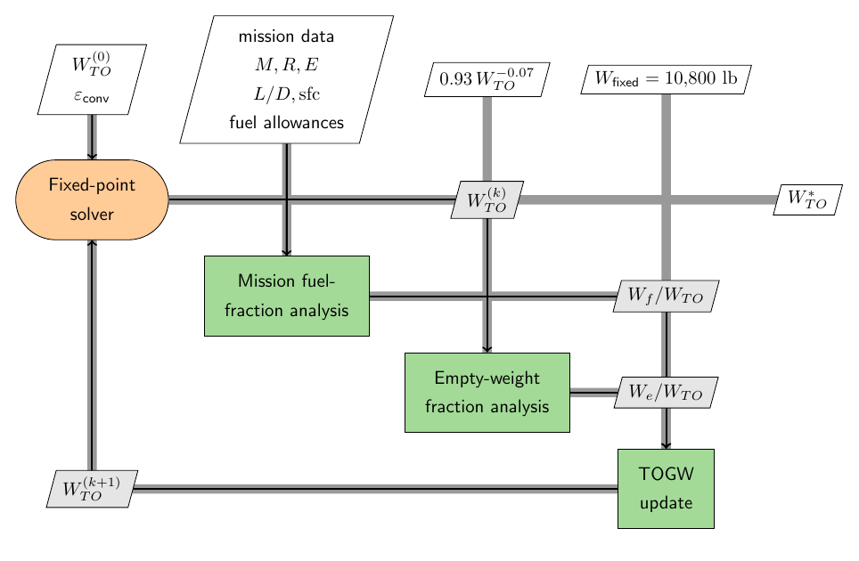

# Step-by-Step Example: Sizing a Notional ASW Aircraft

A minimal takeoff-gross-weight (TOGW) sizing example for a **notional Anti-Submarine Warfare (ASW)** aircraft, using the classic fuel-fraction / empty-weight-fraction method. This narrative stays synchronized with the reusable Python kernel in `../methods/sizing.py` and the interactive Streamlit app in `apps/streamlit/app.py`.

> **Teaching note:** every numerical result shown below comes from the baseline kernel and is rounded only for display.

## Learning Objectives

After working through this example, students should be able to:

1. Translate an ASW mission statement into explicit weight-loss segments.
2. Use Breguet range and endurance relations to compute cruise and loiter weight ratios.
3. Assemble the mission fuel fraction and convert it to a usable fuel-weight fraction.
4. Apply the statistical empty-weight regression and solve the TOGW equation by fixed-point iteration.
5. Explore how changing one assumption propagates through the intermediate calculations and final TOGW.

## Run the Interactive App

From the repository root, install the package and launch the Streamlit app:

```bash
python -m pip install -e .
python -m streamlit run apps/streamlit/app.py
```

The app reproduces the full walkthrough and the interactive sensitivity study from the exact same kernel used in this narrative.

## Mission Requirements

- **Loiter for 3 hours** at **1500 nm** from the takeoff point, then **return to base**, followed by another **20 min loiter** before landing.
- Cruise Mach number: **M = 0.6**
- Mission equipment weight: **10,000 lb**
- Four-man crew totaling **800 lb**

## Mission Profile and Fixed-Point View

| Mission profile | Fixed-point XDSM |
|---|---|
|  |  |

The mission is broken into **8 numbered weight points** (1 → 8), i.e. **7 segments**:

| # | Segment | Description |
|---|---------|-------------|
| 1 → 2 | Warmup & takeoff | Historical ratio |
| 2 → 3 | Climb | Historical ratio |
| 3 → 4 | Cruise | 1500 nm outbound |
| 4 → 5 | Loiter | 3 hr on station |
| 5 → 6 | Cruise | 1500 nm return |
| 6 → 7 | Loiter | 20 min prelanding |
| 7 → 8 | Landing | Historical ratio |

*(Descent is folded into cruise, fraction = 1.0.)*

The XDSM makes the fixed-point structure explicit: mission analysis supplies the fuel fraction, the empty-weight regression supplies the structural fraction, and the update equation feeds the next TOGW guess back into the solver.

---

## The Sizing Equation

Takeoff gross weight is expressed as fixed (payload + crew) weight divided by what remains after subtracting the empty-weight and fuel-weight fractions:

$$W_{TO} = \frac{W_{\text{fixed}}}{1 - \dfrac{W_{\text{empty}}}{W_{TO}} - \dfrac{W_{\text{fuel}}}{W_{TO}}}$$

- **$W_{\text{fixed}}$** is known: $10{,}000 + 800 = \mathbf{10{,}800\ \text{lb}}$.
- **$W_{\text{fuel}}/W_{TO}$** comes from the mission fuel fraction (Steps 1–4 below).
- **$W_{\text{empty}}/W_{TO}$** comes from the statistical empty-weight regression (Step 5).

Because $W_{\text{empty}}/W_{TO}$ itself depends on $W_{TO}$, the equation is solved by **iteration** (Step 6).

---

## Mission Fuel Fraction (MFF)

> **Assumption:** weight change during the mission is due to **fuel consumption only**.

The mission fuel fraction is the product of the individual segment weight ratios:

$$\frac{W_8}{W_1} = \prod_{i=1}^{7} \frac{W_{i+1}}{W_i}, \qquad \mathrm{MFF} = 1 - \frac{W_8}{W_1}$$

Cruise and loiter segments use the **Breguet** equations; the short segments use historical constants.

### Step 1 — Simple-estimate segments (constants)

| Segment | Ratio | Value |
|---------|-------|-------|
| Warmup & takeoff | $W_2/W_1$ | 0.970 |
| Climb | $W_3/W_2$ | 0.985 |
| Descent (part of cruise) | — | 1.000 |
| Landing | $W_8/W_7$ | 0.995 |

### Step 2 — Cruise segments (Breguet range)

$$\frac{W_{i+1}}{W_i} = \exp\!\left(\frac{-R\,\cdot\,\mathrm{sfc}}{V\,(L/D)}\right)$$

**Given / estimated:**

| Quantity | Value | Notes |
|----------|-------|-------|
| Range $R$ | 9,114,000 ft | 1500 nm outbound or return |
| Mach | 0.6 | |
| Cruise altitude | 30,000 ft | typical |
| Speed of sound | $a = 994.8$ ft/s | at 30,000 ft |
| Cruise speed | $V = 0.6 \times 994.8 = 596.88$ ft/s | |
| sfc | 0.5 lb/hr/lb = 0.000139 lb/s/lb | high-bypass turbofan |
| Aspect ratio | $AR = 7.0$ | combined wing + canard |
| Wetted-area ratio | $S_{\text{wet}}/S_{\text{ref}} = 5.5$ | |
| Wetted aspect ratio | $AR_{\text{wet}} = 7.0/5.5 = 1.2727$ | |
| $(L/D)_{\max}$ | 16.0 | from wetted aspect ratio |
| Cruise $L/D$ | $0.866\,(L/D)_{\max} = 13.8560$ | Mach-0.6 cruise factor |

$$\frac{W_4}{W_3} = \exp\!\left(\frac{-9{,}114{,}000 \times 0.000139}{596.88 \times 13.8560}\right) = \exp(-0.1531) = \mathbf{0.8581}$$

The return cruise (Segment 5) is identical: $W_6/W_5 = \mathbf{0.8581}$.

### Step 3 — Loiter segments (Breguet endurance)

$$\frac{W_{i+1}}{W_i} = \exp\!\left(\frac{-E\,\cdot\,\mathrm{sfc}}{L/D}\right)$$

**Given / estimated:** loiter sfc = 0.4 lb/hr/lb = 0.000111 lb/s/lb, and loiter is flown at best endurance so $L/D = (L/D)_{\max} = 16.0$.

**3-hr loiter (Segment 4):** $E = 3.0\ \text{hr} = 10{,}800\ \text{s}$

$$\frac{W_5}{W_4} = \exp\!\left(\frac{-10{,}800 \times 0.000111}{16.0}\right) = \exp(-0.0750) = \mathbf{0.9277}$$

**20-min loiter (Segment 6):** $E = 20\ \text{min} = 1{,}200\ \text{s}$

$$\frac{W_7}{W_6} = \exp\!\left(\frac{-1{,}200 \times 0.000111}{16.0}\right) = \exp(-0.00833) = \mathbf{0.9917}$$

### Step 4 — Assemble the mission fuel fraction

$$\frac{W_8}{W_1} = 0.970 \times 0.985 \times 0.8581 \times 0.9277 \times 0.8581 \times 0.9917 \times 0.995 \approx \mathbf{0.6440}$$

The **fuel weight fraction** adds allowances for reserve fuel (5 %) and trapped/unusable fuel (1 %):

$$\frac{W_{\text{fuel}}}{W_{TO}} = (1 + 0.05 + 0.01)\left(1 - 0.6440\right) \approx \mathbf{0.3773}$$

---

## Step 5 — Empty-Weight Fraction

The empty-weight fraction is taken from a **statistical regression** of historical aircraft (Raymer, military cargo/bomber category):

$$\frac{W_{\text{empty}}}{W_{TO}} = 0.93\,W_{TO}^{-0.07}$$

It decreases slowly as the aircraft grows, which is why the sizing equation must be iterated.

---

## Step 6 — TOGW Iteration

Guess $W_{TO}$, evaluate the empty-weight fraction, then recompute

$$W_{TO}^{\text{new}} = \frac{10{,}800}{1 - 0.3773 - W_{\text{empty}}/W_{TO}}$$

and repeat until the change is negligible.

| Iteration | Guess $W_{TO}$ (lb) | $W_{\text{fixed}}$ (lb) | Fuel frac. | Empty-wt frac. | Empty weight (lb) | New $W_{TO}$ (lb) | Difference (lb) |
|---:|---:|---:|---:|---:|---:|---:|---:|
| 1 | 50,000.0 | 10,800.0 | 0.3773 | 0.4361 | 21,803.4 | 57,881.5 | 7,881.5 |
| 2 | 57,881.5 | 10,800.0 | 0.3773 | 0.4316 | 24,983.0 | 56,534.6 | -1,346.9 |
| 3 | 56,534.6 | 10,800.0 | 0.3773 | 0.4323 | 24,441.9 | 56,746.1 | 211.5 |
| 4 | 56,746.1 | 10,800.0 | 0.3773 | 0.4322 | 24,526.9 | 56,712.4 | -33.7 |
| 5 | 56,712.4 | 10,800.0 | 0.3773 | 0.4322 | 24,513.4 | 56,717.8 | 5.3 |
| 6 | 56,717.8 | 10,800.0 | 0.3773 | 0.4322 | 24,515.6 | 56,716.9 | -0.8 |

The iteration converges to **$W_{TO} \approx 56{,}717\ \text{lb}$**.

---

## Step 7 — Sanity Check

Compare the estimate against a real ASW aircraft of the same class — the **Lockheed S-3 Viking**, whose maximum takeoff weight is about **$W_{TO} = 52{,}539$ lb**.

Our estimate (**56,717 lb**) is about **8.0 %** above the S-3 Viking, which keeps the result in the right ballpark for a first-order conceptual-sizing exercise.

---

## Using the Interactive App

The Streamlit app mirrors the same sequence as the hand calculation, then adds an interactive sensitivity study built on the exact same kernel.

### Controls students can vary

- **Mission and crew:** one-way cruise range, cruise Mach number, cruise altitude, speed of sound at altitude, mission-equipment weight, crew weight, on-station loiter endurance, and prelanding loiter endurance.
- **Segment constants and propulsion:** warmup/takeoff, climb, and landing weight ratios plus cruise and loiter TSFC values.
- **Aerodynamics and allowances:** wing aspect ratio, wetted-area ratio, maximum $L/D$, cruise $L/D$ factor, reserve fuel fraction, trapped/unusable fuel fraction, and the empty-weight regression coefficient/exponent.
- **Solver controls:** initial TOGW guess, convergence tolerance, and maximum iterations.
- **Sensitivity controls:** sweep input, relative span, and sample count for the one-at-a-time final-TOGW sensitivity study.

### What changes after a recompute?

Every click of **Recompute** reruns the full solve from the currently visible inputs. That means the derived cruise quantities, segment ratios, mission fuel fraction, empty-weight fraction history, final TOGW breakdown, iteration table, convergence plots, and final sensitivity plot all update together.

### Sensitivity analysis

The app's sensitivity panel varies **one selected input at a time** across a symmetric span about the current value, reruns the full TOGW solve for each sample, and plots the resulting final TOGW. The baseline app state starts with a **one-way cruise range** sweep over **±10 %** using **9 samples**, and students can redirect that sweep to any visible mission, propulsion, aerodynamic, allowance, or regression input.

---

## Summary of the Method

1. Write $W_{TO} = W_{\text{fixed}} / (1 - W_e/W_{TO} - W_f/W_{TO})$.
2. Get $W_f/W_{TO}$ from the **mission fuel fraction** (product of segment ratios; Breguet for cruise/loiter, constants for the rest), then scale it by reserve and trapped-fuel allowances.
3. Get $W_e/W_{TO}$ from the **historical regression**.
4. **Iterate** $W_{TO}$ to convergence.
5. **Sanity-check** the result against a comparable aircraft and explore sensitivity with the interactive app.
